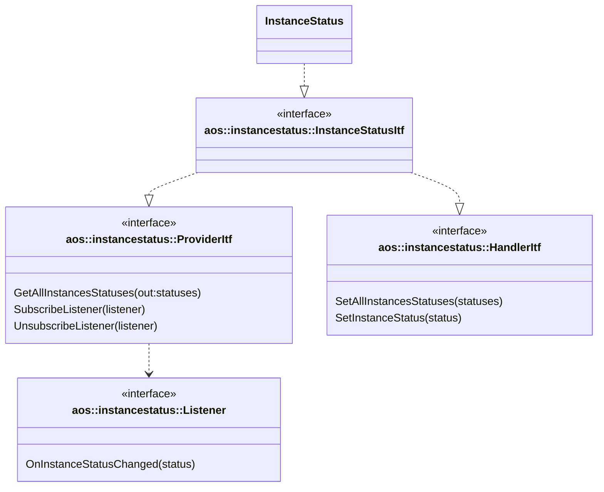
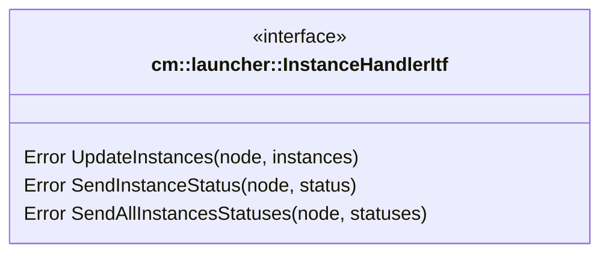
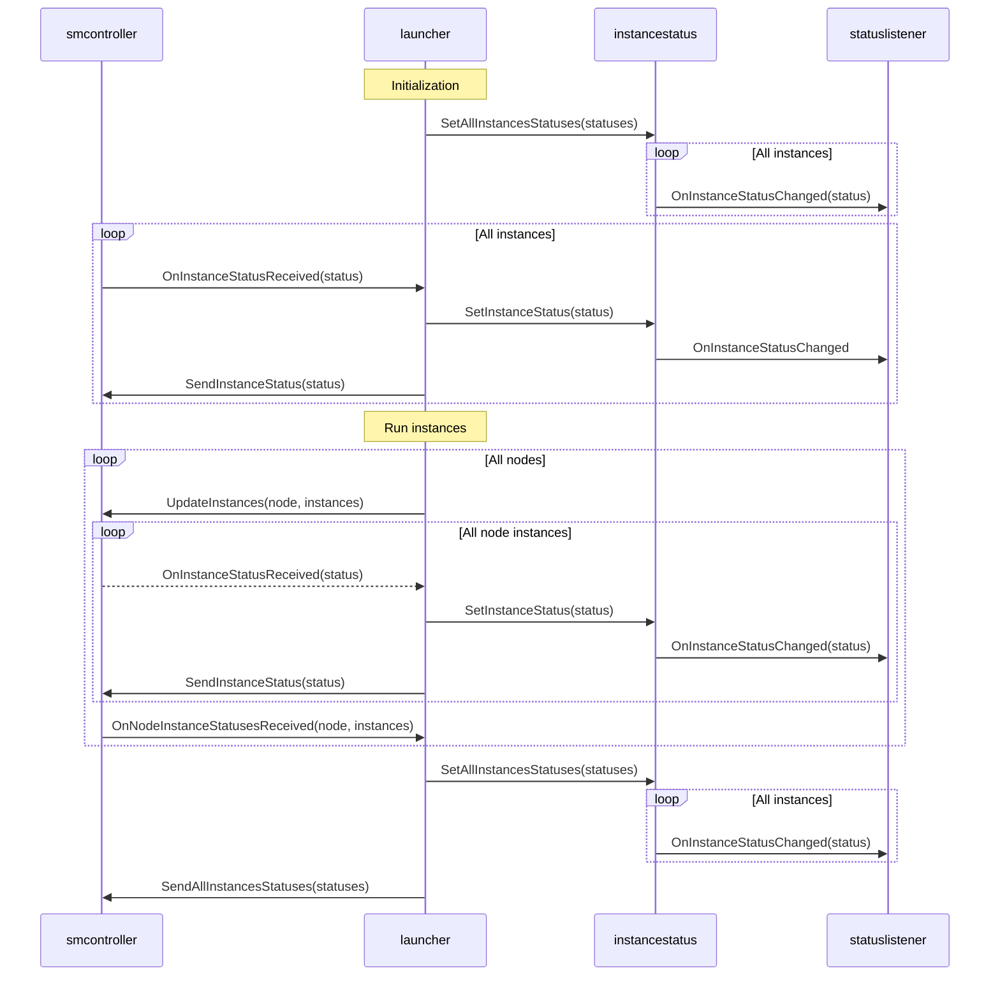
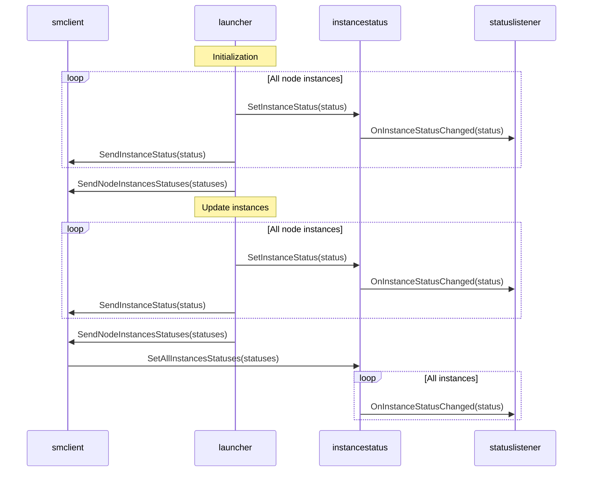
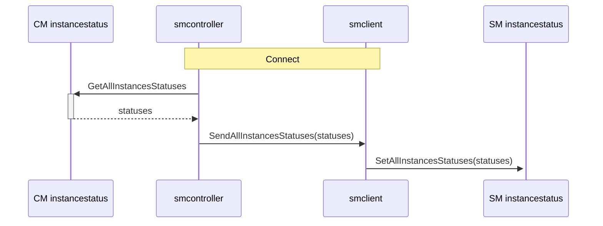

# Runtime dependencies

Requirements (https://kb.epam.com/spaces/EPMPAOS/pages/2460226723/FOTA+SOTA+unification) "Specifying runtime
dependencies  for update items".

## Architecture

* implement `common::instancestatus` module to provide all instances statuses across all nodes;
* use same `common::instancestatus` on CM and SM side;
* perform runtime dependencies normalization and cyclic/missing dependencies check in `cm::launcher`;
* start instances according to runtime dependencies in `sm::launcher` based on instance statuses provided by
  `instancestatus` module.

### Handling instance statuses

1. Replace common module `instancestatusprovider` with `instancestatus` that will be located in CM and SM.

It implements the following interfaces:

* [aos::instancestatus::ProviderItf](itf/provider.hpp) - provides instance statuses for other modules;
* [aos::instancestatus::HandlerItf](itf/handler.hpp) - handles instance status updates from other modules.

2. Rename `cm::launcher::InstanceRunnerItf` to `cm::launcher::InstanceHandlerItf` and add the following methods:

* `SendAllInstancesStatuses` is called for all connected node after receiving `OnNodeInstanceStatusesReceived` message
  from all node SM's;
* `SendInstanceStatus` is called after receiving `OnInstanceStatusReceived` for all connected node SM's except node that
  status is received from.

3. On CM side:

`launcher` uses `instancestatus::HandlerItf` to set instance statuses received from SM. `smcontroller` updates node
instance statuses and then `launcher` update `instancestatus` module with new statuses. `instancestatus` uses
`smcontroller` as `SenderItf` to send instance status updates to other nodes.

4. On SM side:

5. SM CM communication:

6. Update instance state:

* eScheduled - instance is scheduled to run but not running yet;
* eDependency - instance is waiting for dependencies to be satisfied;
* eActivating - instance is activating;
* eActive - instance is active;
* eInactive - instance is inactive;
* eFailed - instance failed to activate.
* eRemoved - instance is removed.

### Dependency handling on CM side

* `cm::launcher` should normalize dependencies:
  * `sm::launcher` can't handle before deps, though `cm::launcher` should convert before deps to after deps and add them
    to instance dependencies;
  * `sm::launcher` doesn't know total num of deps instances, therefore `cm::launcher` should add total num of deps
    instances to instance dependencies;
* check cyclic or missing dependencies before running instances. If cyclic dependencies are detected, CM should not
  schedule these instances and set their state to eFailed with corresponding error message.

### Dependency handling on SM side

* once `UpdateInstance` command is received, `sm::launcher` gets all instances statuses and sets `eDependency` state for
  all instances that have unsatisfied dependencies;
* `sm::launcher` subscribes to instance status updates from `instancestatus` module and check if dependencies are
  satisfied for each instance. That instances that have all dependencies satisfied are scheduled to run;
* instances should be grouped by priorities: if `sm::launcher` ready to start some instances with different priorities,
  it should start instances with higher priority first. Wait for all instances with higher priority to be actually
  started and then start instances with lower priority.

## TODO

### Cloud protocol

* add runtime dependencies to update item config;

### API

* `UpdateInstances` message should contain only scheduled instances instead of start/stop instances;
* `InstanceInfo` message should contain instance dependencies and total num of deps instances;
* `update_instances_status` should be renamed to `instance_status` and contain only one instance status;
* add `all_instances_statuses` message to send all instances statuses in one message.

### common::instancestatus

* implement `common::instancestatus` module;
* initialize it and add to CM and SM.

### cm::launcher

* add runtime deps to aos::InstanceInfo struct;
* update instance states at initialization - should be set to eScheduled;
* modify and use `cm::launcher::InstanceRunnerItf`;
* add handling of `instancestatus::HandlerItf` to update instance statuses received from SM;
* send update instances with desired instances to SM on `UpdateInstances` command;
* implement runtime deps normalization on run instances;
* implement cyclic and missing dependencies check on run instances.

### cm::database

* add instance runtime dependencies and total num of deps instances to database for `launcher::StorageItf`.

### cm: smcontroller

* update `cm::launcher::InstanceHandlerItf` implementation;
* send all instances statuses to SM on SM connection.

### sm::launcher

* add handling of `instancestatus::HandlerItf` to update instance statuses;
* handle `UpdateInstances` command with desired instances only;
* update `SenderItf`: rename `SendUpdateInstancesStatuses` to `SendInstanceStatus` with one instance status;
* implement runtime deps handling on update instances;
* implement instances grouping by priorities and starting instances with higher priority first.

### sm::database

* add instance runtime dependencies and total num of deps instances to database for `launcher::StorageItf`.

### sm::smclient

* use `instancestatus::HandlerItf` to update instance status and all instances statuses received from CM;
* handle `InstanceInfo` struct with instance dependencies and total num of deps instances.

### sm::monitoring

* filter instances state by node: add only current node instances to monitoring.

## Discuss with cloud

1. New instance states

## Negotiate requirements needed

1. Priority and runtimes deps: how to handle priority and runtime deps together?
2. Shall we add `required` dependency?
3. versions are compatible to SemVer spec - Versioning rules. Shall we pass version to core as only one version of
   update item may exist?

## Open questions

1. Currently we don't support use case when there are instances on the same service but different versions on the core.
   We always update all services to the latest available version. Usually such scenarios are possible in kubernetes or
   docker compose when we can have few different versions of the same service that are running at the same time:

    server A v1.0.0
    server A v2.0.0

    and for example, server B that depends on server A v1.0.0 and server C that depends on server A v2.0.0:

    server B -> server A v1.0.0
    server C -> server A v2.0.0

    shall we support such use case in our system? Otherwise, we should implement dependency without version:

    server B -> server A
    server C -> server A

2. Order of dependencies: shall we support only one way of dependencies such as depends on (docker compose style) or
   both ways such as before, after, required and required-by (systemd style)? This affects complexity of implementation:
   one way is simpler to implement and understand, but another way is more flexible and allows to cover more use cases.

   Normal case (one way dependencies):

   SP1 Service A (server)

   SP2 Service B (client) -> [depends on] -> SP1 Service A (server)

   But If SP2 would like to start its service before SP1 service, then we should support another way of dependencies:

   SP1 Service A (server) -> [before] -> SP2 Service B (client)

   because SP2 can't modify SP1 service config to add depends on dependency.

3. Currently, we have service priority according to which we calculate and allocate resources for services. Now, with
   runtime dependencies, we may have situation when some services with higher priority depends on service with lower
   priority. For example:

   Service B (priority 1) -> [depends on] -> Service A (priority 0)
   Service C (priority 1) -> [depends on] -> Service A (priority 0)

   But Service A can't be started because there are no resources allocated for it.

   In this case we have few options:

    * implicitly increase priority of Service A to highest priority of dependent services;
    * indicate this situation by instance statuses: in this case core will report that:
        * Service A has not enough resources and can't be started;
        * Service B and Service C are waiting for dependencies to be satisfied;
        * remove priority from services and calculate resources for all services without priority but according to
          runtime dependencies.

4. Shall cloud performs dependency check to identify cyclic dependencies and missing dependencies before sending update
   item to core? And notify user about such issues?
