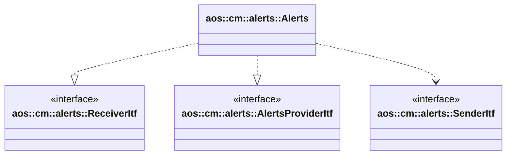

# Alerts

Alerts module receives alerts from SM's, buffers and aggregates them into suitable for Aos cloud messages.

It implements the following interfaces:

* [aos::cm::alerts::ReceiverItf](itf/receiver.hpp) - receives SM's alerts.
* [aos::cm::alerts::AlertsProviderItf](itf/provider.hpp) - allows other modules to subscribe on alerts.

It requires the following interfaces:

* [aos::cm::alerts::SenderItf](itf/sender.hpp) - sends aggregated alert messages to Aos cloud.

## Alerts cache

The alerts module maintains an internal cache used to aggregate alerts, ensuring only unique entries are stored.
Alerts are considered unique based on their payload, the timestamp is not included in the comparison.

Alerts are sent to the cloud at regular intervals, with the transmission period configured through a parameter.

If the cloud connection is lost, alerts cannot be sent, and the cache continues to grow until it reaches its capacity.
Once full, new alerts are discarded. As a result, when the connection is restored, the oldest alerts (often the most
relevant and detailed) are sent to the cloud first.

## Alerts listeners

The alerts module allows other components to subscribe as listeners to receive notifications when
new alerts are received. Listeners specify which alert tags they are interested in, and are notified only
about alerts matching those tags.

## aos::cm::alerts::Alerts

### Init

Initializes the alerts object instance.

### Start

Starts the alerts object instance.

### Stop

Stops the alerts object instance.

### OnAlertReceived

Accepts an alert message, stores it in the local cache for the future sending.

### OnConnect

Notifies the alerts object instance that the cloud connection is established.

### OnDisconnect

Notifies the alerts object instance that the cloud connection is lost.

### SubscribeListener

Subscribes a listener to receive alerts notifications with specified alert tags.

### UnsubscribeListener

Unsubscribes a listener from receiving alerts notifications.
