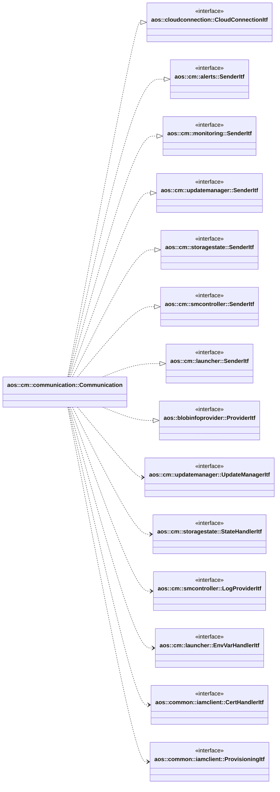

# Communication

Communication is responsible for communication between unit and Aos cloud.

It implements the following interfaces:

* [aos::connectionprovider::CloudConnectionItf](../../common/connectionprovider/itf/cloudconnection.hpp) -
  provides cloud connection state to other modules;
* [aos::cm::alerts::SenderItf](../alerts/itf/sender.hpp) - sends alerts to the cloud;
* [aos::cm::monitoring::SenderItf](../monitoring/itf/sender.hpp) - sends monitoring to the cloud;
* [aos::cm::updatemanager::SenderItf](../updatemanager/itf/sender.hpp) - sends unit status to the cloud;
* [aos::cm::storagestate::SenderItf](../storagestate/itf/sender.hpp) - sends instance state request and new state
  notification;
* [aos::cm::smcontroller::SenderItf](../smcontroller/itf/sender.hpp) - sends log messages;
* [aos::cm::launcher::SenderItf](../launcher/itf/senderitf.hpp) - sends override env vars statuses;
* [aos::blobinfoprovider::ProviderItf](../../common/blobinfoprovider/itf/blobinfoprovider.hpp) - provides blobs info.

It requires the following interfaces:

* [aos::cm::updatemanager::UpdateManagerItf](../updatemanager/itf/updatemanager.hpp) - processes desired status received
  from cloud;
* [aos::cm::storagestate::StateHandlerItf](../storagestate/itf/statehandler.hpp) - updates and accepts instance state;
* [aos::cm::smcontroller::LogProviderItf](../smcontroller/itf/logprovider.hpp) - requests logs;
* [aos::cm::launcher::EnvVarHandlerItf](../launcher/itf/envvarhandler.hpp) - overrides instances env vars;
* [aos::common::iamclient::CertHandlerItf](../../common/iamclient/itf/certhandler.hpp) - renews nodes certificates;
* [aos::common::iamclient::ProvisioningItf](../../common/iamclient/itf/provisioning.hpp) - performs node provisioning.

