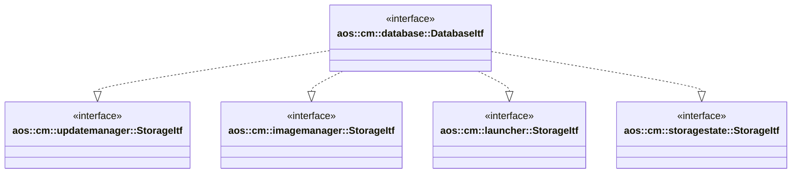

# Database

The database module provides persistent storage for various CM modules. It implements storage interfaces for the
following modules:

- [aos::cm::updatemanager::StorageItf](../updatemanager/itf/storage.hpp) - update manager storage interface;
- [aos::cm::imagemanager::StorageItf](../imagemanager/itf/storage.hpp) - image manager storage interface;
- [aos::cm::launcher::StorageItf](../launcher/itf/storage.hpp) - launcher storage interface;
- [aos::cm::storagestate::StorageItf](../storagestate/itf/storage.hpp) - storage state storage interface.

