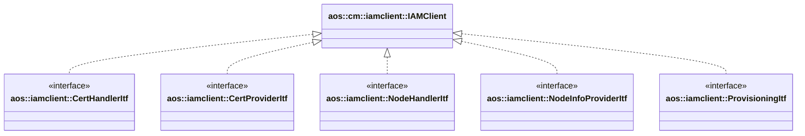

# IAM client

Provides access to IAM services.

It implements the following interfaces:

* [aos::iamclient::CertHandlerItf](../../common/iamclient/itf/certhandler.hpp) -
  handles keys and certificates (renew, provisioning);
* [aos::iamclient::CertProviderItf](../../common/iamclient/itf/certprovider.hpp) -
  provides info about current keys and certificates;
* [aos::iamclient::NodeHandlerItf](../../common/iamclient/itf/nodehandler.hpp) - handles nodes states (pause, resume);
* [aos::iamclient::NodeInfoProviderItf](../../common/iamclient/itf/nodeinfoprovider.hpp) - provides nodes info;
* [aos::iamclient::ProvisioningItf](../../common/iamclient/itf/provisioning.hpp) - performs node provisioning.

