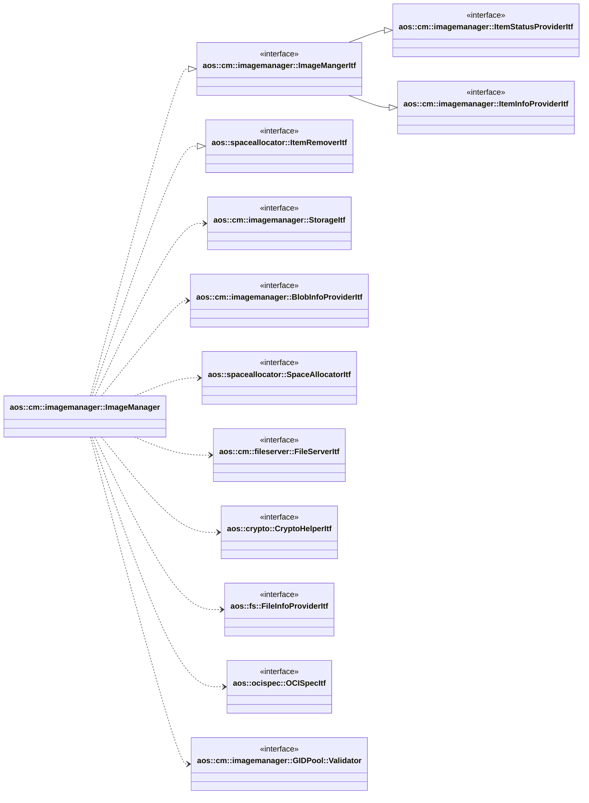

# Image manager

Image manager stores update item images and provide update item image info for other modules.

It implements the following interfaces:

* [aos::cm::imagemanager::ImageMangerItf](itf/imagemanager.hpp) - manages update items images;
* [aos::cm::imagemanager::ItemStatusProviderItf](itf/itemstatusprovider.hpp) - provides update items statuses;
* [aos::cm::imagemanager::ItemInfoProviderItf](itf/iteminfoprovider.hpp) - provides update items info;
* [aos::spaceallocator::ItemRemoverItf](../../common/spaceallocator/spaceallocator.hpp) - remove outdated items.

It requires the following interfaces:

* [aos::cm::imagemanager::StorageItf](itf/storage.hpp) - stores internal persistent data;
* [aos::cm::imagemanager::BlobInfoProviderItf](itf/blobinfoprovider.hpp) - retrieves blobs info;
* [aos::spaceallocator::SpaceAllocatorItf](../../common/spaceallocator/spaceallocator.hpp) - allocates disk space for
  calculating required disk size;
* [aos::cm::fileserver::FileServerItf](../fileserver/itf/fileserver.hpp) - translates local file path's to remote URL's;
* [aos::crypto::CryptoHelperItf](../../common/crypto/itf/cryptohelper.hpp) - decrypts and verifies update images;
* [aos::fs::FileInfoProviderItf](../../common/tools/fs.hpp) - gets file info (size, checksum, etc.);
* [aos::ocispec::OCISpecItf](../../common/ocispec/ocispec.hpp) - parses OCI spec files;
* [aos::cm::imagemanager::GIDPool::Validator](imagemanager.hpp) - validates GID on the platform.



## Overview

Aos update items consists of set of blobs according to
[OCI specification](https://github.com/opencontainers/image-spec/blob/main/image-layout.md).
Image manager puts all blobs into the install folder with corresponding to digest name:

```console
./blobs/sha256/3588d02542238316759cbf24502f4344ffcc8a60c803870022f335d1390c13b4
./blobs/sha256/4b0bc1c4050b03c95ef2a8e36e25feac42fd31283e8c30b3ee5df6b043155d3c
./blobs/sha256/7968321274dc6b6171697c33df7815310468e694ac5be0ec03ff053bb135e768
```

Unlike OCI specification, Aos image manger puts `index.json` as separate blob into the install folder together with
other blobs.

To assemble the update item, image manger store the index file digest in its internal storage. It allows to retrieve
whole update item layers chain by reading the index file.

## Initialization

During initialization:

* creates install directory if it doesn't exist;
* verifies integrity of each update item and removes corrupted or not fully installed items;
* removes outdated items;
* remove orphaned blobs (blobs that are not referenced by any update item);
* mark deleted items as outdated to space allocator;

## Removing outdated items

Image manager has configuration parameter that indicates how long removed update items should be stored on file system.
If update item is in deleted state more than configured timeout, this item should be completely removed from the unit.

For this purpose, image manager checks and removes outdated update items during initialization and also performs
periodic check for outdated items (with subsequent removal). After removing some update items from the system, image
manager removes orphaned blobs.

## aos::cm::imagemanager::ImageMangerItf

### DownloadUpdateItems

Downloads update items and set them to pending state.

Downloading procedure consists of the following steps:

* cleanup downloading items - removes update items that are in downloading or pending state and that are not listed in
  the current download request;
* cleanup downloading blobs - cleanups previously downloading blobs that are not listed in the current download request;
* remove orphaned blobs - removes blobs that are not referenced by any item;
* update existing item states - existing installed update items that have all valid blobs remains in installed state.
  Other update items that have valid blobs are set to pending state. For newly create update items dedicated group ID
  (GID) should be selected. And remaining update items are set to downloading state;
* download missing or corrupted blobs - downloads, validates and decrypts blobs that are missing or corrupted;
* update downloading items state - after successful blobs download, downloading items that have valid blobs are set to
  pending state. If blob downloading fails or any other error occurs, the corresponding update items are set to failed
  state.

### InstallUpdateItems

Installs update items in parallel.

This method performs the following actions:

* removes existing different version of the specified update items in order to have only one update item version on the
  system;
* verifies blobs integrity for each specified update items. Removes the item if checking integrity fails and return
  failed state for this item;
* sets specified update items with valid blobs state to installed;
* sets existing and not specified items state to removed state;
* removes orphaned blobs.

### Cancel

Cancels ongoing operation download or install.

This methods terminates currant download or install operation. Items that are not properly downloaded or installed
should be set to failed status with canceled error.

## aos::cm::imagemanager::ItemStatusProviderItf

### GetUpdateItemsStatuses

Returns all update items statuses.

### SubscribeListener

Subscribes to changing update item statuses.

### UnsubscribeListener

Unsubscribes from changing update item statuses.

## aos::cm::imagemanager::ItemStatusListenerItf

### OnItemStatusChanged

This method is called for each registered listener when update item status is changed.

### OnUpdateItemRemoved

This method is called for each registered listener when specified update item is completely removed from file system.
It is required to perform cleanup operation by other modules e.g. remove associated instances etc.
It is not called when update item is set to removed state.

## aos::cm::imagemanager::ItemInfoProviderItf

### GetIndexDigest

Returns index digest of update item. It returns index file digest for installed or pending items.

### GetBlobPath

Returns blob path by digest.

### GetBlobURL

Returns blob URL by digest.

### GetItemCurrentVersion

Return version of installed item.
