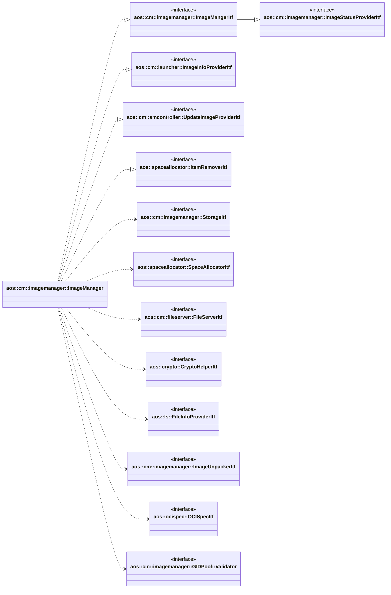

# Image manager

Image manager stores update item images and provide update item image info for other modules.

It implements the following interfaces:

* [aos::cm::imagemanager::ImageMangerItf](itf/imagemanager.hpp) - manages update items images;
* [aos::cm::imagemanager::ImageStatusProviderItf](itf/imagestatusprovider.hpp) - provides update images statuses;
* [aos::cm::smcontroller::UpdateImageProviderItf](../smcontroller/itf/updateimageprovider.hpp) - provides update image
  info;
* [aos::cm::launcher::ImageInfoProviderItf](../launcher/itf/imageinfoprovider.hpp) - provides images metadata;
* [aos::spaceallocator::ItemRemoverItf](../../common/spaceallocator/spaceallocator.hpp) - remove outdated items.

It requires the following interfaces:

* [aos::cm::imagemanager::StorageItf](itf/storage.hpp) - stores internal persistent data;
* [aos::spaceallocator::SpaceAllocatorItf](../../common/spaceallocator/spaceallocator.hpp) - allocates disk space for
  calculating required disk size;
* [aos::cm::fileserver::FileServerItf](../fileserver/itf/fileserver.hpp) - translates local file path's to remote URL's;
* [aos::crypto::CryptoHelperItf](../../common/crypto/itf/cryptohelper.hpp) - decrypts and verifies update images;
* [aos::fs::FileInfoProviderItf](../../common/tools/fs.hpp) - gets file info (size, checksum, etc.);
* [aos::cm::imagemanager::ImageUnpackerItf](itf/imageunpacker.hpp) - unpacks different image types;
* [aos::ocispec::OCISpecItf](../../common/ocispec/ocispec.hpp) - parses OCI spec files;
* [aos::cm::imagemanager::GIDPool::Validator](imagemanager.hpp) - validates GID on the platform.

## Initialization

During initialization:

* creates installation directory if it doesn't exist;
* clears temporary directory;
* verifies integrity of each item and removes corrupted or not fully installed items;
* removes orphaned items (directories without corresponding database entries);
* removes outdated items.

## Removing outdated items

Image manager has configuration parameter that indicates how long cached update items should be stored on file system.
If update item is in cached state more than configured timeout, this item should be completely removed from the unit.

For this purpose, image manager checks and removes outdated items during initialization and also performs periodic check
for outdated items (with subsequent removal).

## aos::cm::imagemanager::ImageMangerItf

### GetUpdateItemsStatuses

Returns currently installed images statuses for each update item. It returns only active update items versions.

### InstallUpdateItems

Installs update items images in parallel.

This method performs the following actions:

* decrypts update item images and verifies signature;
* unpacks certain update item types images in order to retrieve metadata or/and modify it and store it in the internal
  storage. It is required to provide frequently used data to other modules:
  * for service items: unpacks service images to extract and store service configuration, image configuration, and GID
    (Group ID) metadata;
  * for layer items: unpacks layer images to extract and store layer metadata;
* caches outdated items for revert purpose;
* in case when installation of any desired update item image fails, error with corresponding update item status is
  returned and all artifacts of this update item version are removed from file system.

This method maintains update item versions as following:

* if there is no such update item already installed, this update item is installed normally;
* if there is already such update item installed then versions of installed and requested update items compares and next
  actions are performed based on version comparison result:
  * if requested item version is less than installed item version, version mismatch error is returned;
  * if requested item version equals to installed item version and requested item images differ from installed item
    images, then differ requested images should be installed over existing differ images. Otherwise, no action is
    performed and installed status for all images is returned;
  * if requested item version is greater than installed item version, requested item is installed normally and then
    existing item is marked as cached. It is required to perform update item revert. If there are cached version of this
    item before install, this item version is completely removed from file system before install requested one. Image
    manager doesn't keep more than two versions (one active and one cached) of the same item at the same time;
* if there is already such update item installed but in cached state, then versions of cached and requested update
  items compares and next actions are performed based on version comparison result:
  * if version of cached item is less than requested item version, requested item version is installed normally;
  * if version of cached item equals to requested item version, cached version becomes active if all images of cached
    item are identical to all images of requested item. Otherwise, images are updated and item becomes active;
  * if version of cached item is grated then requested then cached item is removed and requested item normally
    installed.

### UninstallUpdateItems

Uninstalls update item images in parallel.

This method performs the following actions:

* mark requested update item as cached. If there is already cached version of the requested item, the cached version is
  removed in order to have only one cached version of update item at the same time.

### RevertUpdateItems

Reverts update item images in parallel.

This method performs the following actions:

* if there is active and cached version of requested item, active version is removed from file system and cached version
  is marked as active;
* if there is only active version of requested item, it is remove from file system;
* if there is only cached version of requested item, `not found` error is returned.

## aos::cm::imagemanager::StatusNotifierItf

Notifies subscribers about changing update item images statuses.

### SubscribeListener

Subscribes to changing update item statuses.

### UnsubscribeListener

Unsubscribes from changing update item statuses.

## aos::cm::imagemanager::StatusListenerItf

### OnImageStatusChanged

This method is called for each registered listener image status of update item is changed.

### OnUpdateItemRemoved

This method is called for each registered listener when specified update item is completely removed from file system.
It is required to perform cleanup operation by other modules e.g. remove associated instances etc.
It is not called when update item becomes cached.

## aos::cm::launcher::ImageInfoProviderItf

### GetItemImages

Returns list of images infos for specified update item. The image info contains such information as image ID and
platform info.

### GetServiceConfig

Returns service config for specified update item image. The item should be the service type. For other types `not found`
is returned.

### GetImageConfig

Returns image config for specified update item image. The item should be the service type. For other types `not found`
is returned.

## aos::cm::smcontroller::UpdateImageProviderItf

### GetUpdateImageInfo (by ID and platform)

Returns image info for specified update item ID and platform. The image info contains image version, URL to download,
size, checksum etc.

### GetUpdateImageInfo (by item ID and image ID)

Returns image info for specified update item ID and image ID. This method retrieves the image information from the
active version of the item. The image info contains image ID, version, URL to download, size, checksum etc.

### GetLayerImageInfo

Returns image info for specified layer digest. The image info contains layer URL to download, size, checksum etc.
