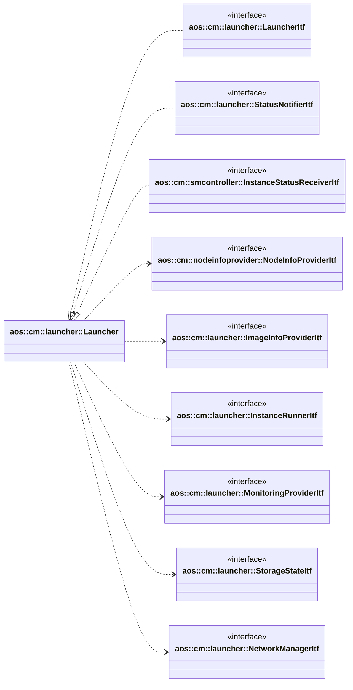
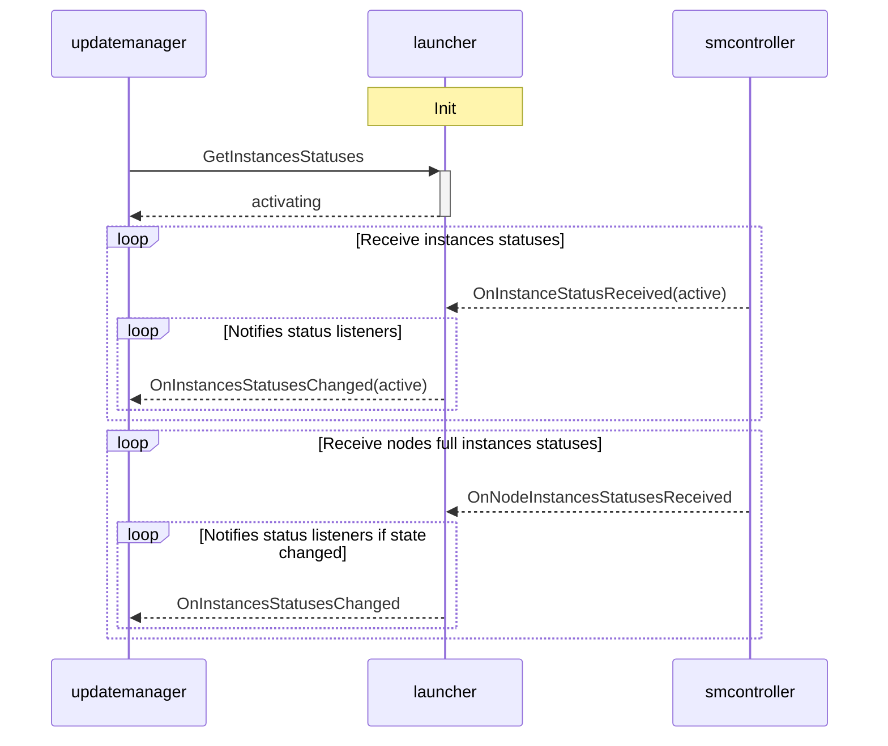
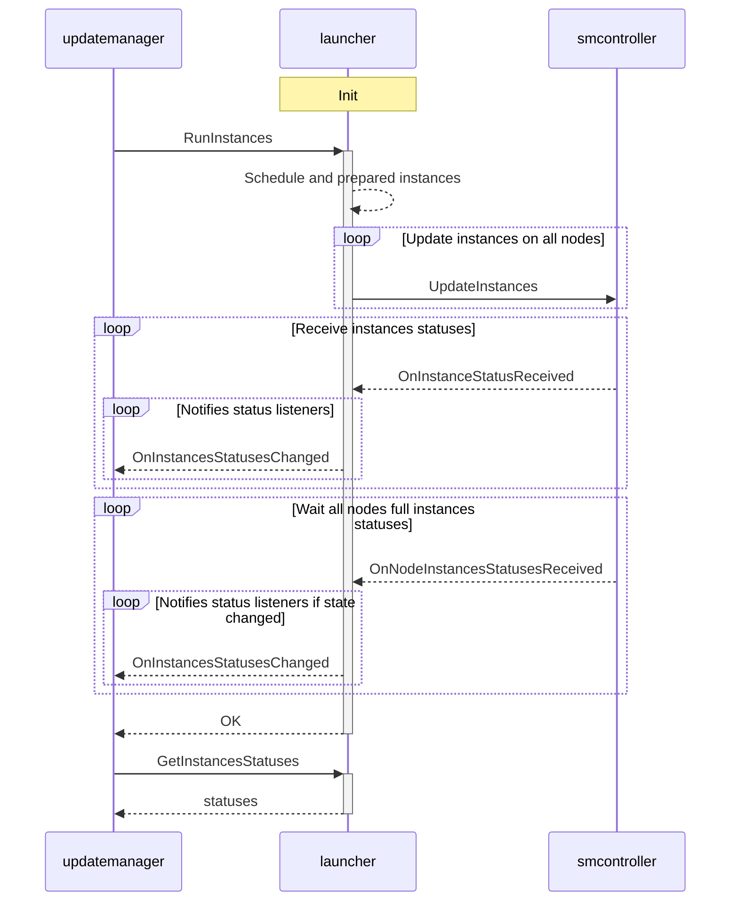

# Launcher

Launcher schedules update items instances on corresponding nodes and runtimes based on priorities, resources
availability etc,.

It implements the following interfaces:

* [aos::cm::launcher::LauncherItf]() - main launcher interface to schedule and run instances;
* [aos::cm::launcher::StatusNotifierItf]() - notifies other modules about instances statuses;
* [aos::cm::smcontroller::InstanceStatusReceiverItf]() - receives instances statuses from SM controller [smcontroller]()
  module.

It requires the following interfaces:

* [aos::cm::nodeinfoprovider::NodeInfoProviderItf]() - gets node information;
* [aos::cm::launcher::ImageInfoProviderItf]() - obtains image info required to schedule instances such as resource
  requests, required resources, network parameters etc.;
* [aos::cm::launcher::InstanceRunnerItf]() - runs instances on nodes;
* [aos::cm::launcher::MonitoringProviderItf]() - gets average instances CPU and RAM consumption;
* [aos::cm::storagestate::StorageStateItf]() - prepares storage and state for instances;
* [aos::cm::networkmanager::NetworkManagerItf]() - configures instances notwork.

## Initialization

At initialization all previously scheduled instances states are set to `activating`. Then they are updated on receiving
instance status or receiving full node instances statuses. If instances status is not received during configurable
timeout, error state is set for these instances.

Launcher subscribes to node info changing and if a node goes into error state, all these node instances are switched to
error state as well. All subscribed status listeners are notified about instances error states in this case.

Normal startup sequence looks as the following:

## aos::cm::launcher::LauncherItf

### GetInstancesStatuses

Returns current instances statuses.

### RunInstances

Schedules and run desired instances. Launcher calculates on which node and which runtime to start a specific instance
based on requested resources, instance, node priorities etc.

This function is blocked till all update instances requests are confirmed or fail.

Waiting for node instances status is guarded by configured timeout, if timeout occurs and no node instances statuses
received, this node instances statuses are set to error. If a pending node state becomes error, all this instances
states are set to error as well.

### Rebalance

Request to rebalance instances. It may occur due to CPU or memory usage is higher than specified threshold on a node or
node parameters, resources are changed.

This function is blocked till all update instances requests are confirmed or fail.

## aos::cm::launcher::StatusNotifierItf

Notifies subscribers about changing instances statuses.

### SubscribeListener

Subscribes to changing instances statuses.

### UnsubscribeListener

Unsubscribes from changing instances statuses.

## aos::cm::smcontroller::InstanceStatusReceiverItf

### OnInstanceStatusReceived

Called when instance status is received from SM. New status is compared with internal one and if state is changed all
subscribed to status change listeners are notified.

### OnNodeInstancesStatusesReceived

Called when full node instances statuses are received from SM. New statuses are compared with internal ones and if
states are changed all subscribed to status change listeners are notified.

This notification is sent by SM on start after all previously scheduled instances are launched and as the response on
update instances request.
