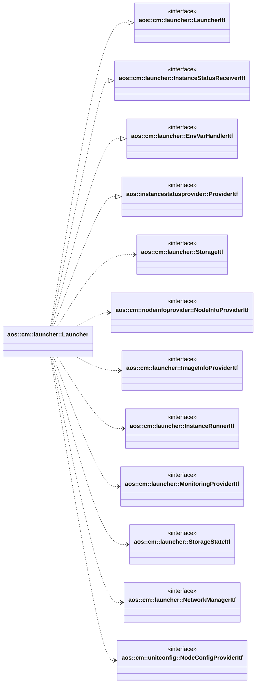
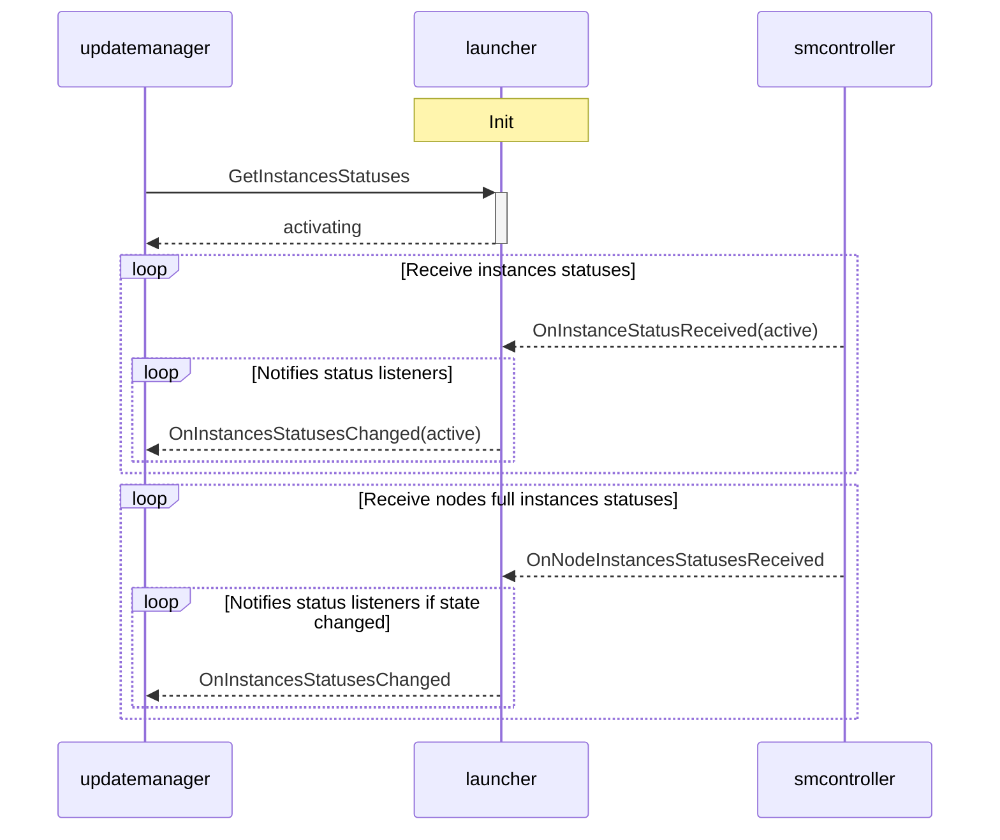
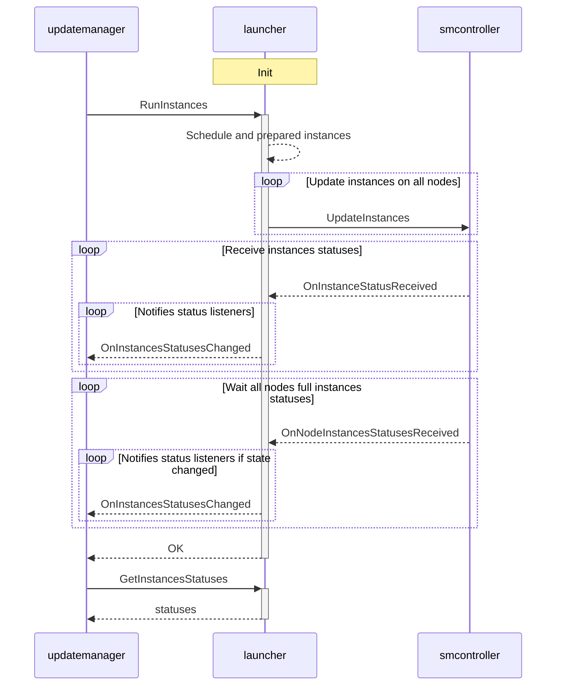
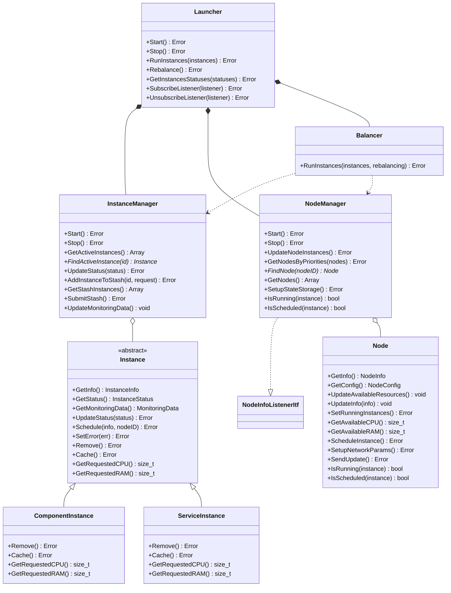

# Launcher

Launcher schedules update items instances on corresponding nodes and runtimes based on priorities, resources
availability etc. The launcher handles two distinct types of instances:

- `service instances`: processes that run inside containers (run/crun) and are managed by systemd;
- `component instances`: system entities such as new root filesystems, system partitions, or other system-level
  components;

It implements the following interfaces:

- [aos::cm::launcher::LauncherItf](itf/launcher.hpp) - main launcher interface to schedule and run instances;
- [aos::cm::launcher::InstanceStatusReceiverItf](itf/instancestatusreceiver.hpp) - receives instances statuses;
- [aos::cm::launcher::EnvVarHandlerItf](itf/envvarhandler.hpp) - overrides instances env vars;
- [aos::instancestatusprovider::ProviderItf](../../common/instancestatusprovider/itf/instancestatusprovider.hpp) -
  notifies other modules about instances statuses.

It requires the following interfaces:

- [aos::cm::launcher::StorageItf](itf/storage.hpp) - stores internal persistent data;
- [aos::cm::nodeinfoprovider::NodeInfoProviderItf](../nodeinfoprovider/itf/nodeinfoprovider.hpp) -
  gets node information;
- [aos::cm::launcher::ImageInfoProviderItf](itf/imageinfoprovider.hpp) - obtains image info required to schedule
  instances such as resource requests, required resources, network parameters etc.;
- [aos::cm::launcher::InstanceRunnerItf](itf/instancerunner.hpp) - runs instances on nodes;
- [aos::cm::launcher::MonitoringProviderItf](itf/monitoringprovider.hpp) - gets average instances CPU and RAM
  consumption;
- [aos::cm::storagestate::StorageStateItf](../storagestate/itf/storagestate.hpp) - prepares storage and state for
  instances;
- [aos::cm::networkmanager::NetworkManagerItf](../networkmanager/itf/networkmanager.hpp) - configures instances notwork;
- [aos::cm::unitconfig::NodeConfigProviderItf](../unitconfig/itf/nodeconfigprovider.hpp) - gets node configuration.

## Initialization

At initialization all previously scheduled instances states are set to `activating`. Then they are updated on receiving
instance status or receiving full node instances statuses. If instances status is not received during configurable
timeout, error state is set for these instances.

Launcher subscribes to node info changing and if a node goes into error state, all these node instances are switched to
error state as well. All subscribed status listeners are notified about instances error states in this case.

Normal startup sequence looks as the following:

## aos::cm::launcher::LauncherItf

### GetInstancesStatuses

Returns current instances statuses.

### RunInstances

Schedules and run desired instances. Launcher calculates on which node and which runtime to start a specific instance
based on requested resources, instance, node priorities etc.

This function is blocked till all update instances requests are confirmed or fail.

Waiting for node instances status is guarded by configured timeout, if timeout occurs and no node instances statuses
received, this node instances statuses are set to error. If a pending node state becomes error, all this instances
states are set to error as well.

### Rebalance

Request to rebalance instances. It may occur due to CPU or memory usage is higher than specified threshold on a node or
node parameters, resources are changed.

This function is blocked till all update instances requests are confirmed or fail.

## aos::cm::launcher::StatusNotifierItf

Notifies subscribers about changing instances statuses.

### SubscribeListener

Subscribes to changing instances statuses.

### UnsubscribeListener

Unsubscribes from changing instances statuses.

## aos::cm::smcontroller::InstanceStatusReceiverItf

### OnInstanceStatusReceived

Called when instance status is received from SM. New status is compared with internal one and if state is changed all
subscribed to status change listeners are notified.

### OnNodeInstancesStatusesReceived

Called when full node instances statuses are received from SM. New statuses are compared with internal ones and if
states are changed all subscribed to status change listeners are notified.

This notification is sent by SM on start after all previously scheduled instances are launched and as the response on
update instances request.

## Class structure

This class diagram illustrates the architecture of the Launcher system, which manages the lifecycle of service and
component instances across multiple nodes in a distributed environment. The system handles instance scheduling, resource
allocation, and load balancing.

### External Interfaces

The system depends on several external interfaces that provide essential functionality:

- `StorageItf` - Persistent storage for instance information
- `StorageStateItf` - Manages storage and state partitions for instances
- `ImageInfoProviderItf` - Retrieves service configurations and image information
- `ResourceManagerItf` - Provides node configurations and resource information
- `NodeInfoProviderItf` - Provides information about available nodes
- `InstanceRunnerItf` - Starts/stops instances across nodes
- `MonitoringProviderItf` - Provides monitoring data for nodes and instances
- `NetworkManagerItf` - Manages network parameters for service instances

### Launcher implementation

**Main Component:**

- `Launcher` - The primary entry point and coordinator for the entire module

**Implemented Interfaces:**

- `LauncherItf` - Defines the contract for running instances and rebalancing
- `InstanceStatusProviderItf` - Provides current instance statuses to subscribers

**Key Responsibilities:**

- Orchestrates instance lifecycle operations (run, stop, rebalance)
- Coordinates between InstanceManager, NodeManager, and Balancer
- Notifies subscribers of instance status changes

### Layer 3: Managers & Balancer

**InstanceManager:**

- Tracks all active instances in the system
- Manages instance stashing (temporary storage before scheduling)
- Updates instance statuses and monitoring data
- Handles instance lifecycle (create, update, remove)

**NodeManager:**

- Manages the collection of available nodes
- Tracks node resources and capabilities
- Updates node instances based on scheduling decisions
- Implements `NodeInfoListenerItf` to receive node information updates
- Provides state storage setup for instances

**Balancer:**

- Performs intelligent scheduling of instances to nodes
- Evaluates node resources, capabilities, and constraints
- Handles both initial placement and rebalancing scenarios
- Filters nodes based on runtime requirements, labels, and available resources

### Instance & Node

**Instance Hierarchy:**

- `Instance` (abstract) - Base class for all instance types with common functionality
  - `ComponentInstance` - Represents system entities (rootfs, system partitions)
  - `ServiceInstance` - Represents processes running inside containers (run/crun) managed by systemd

**Instance Capabilities:**

- Resource calculation (CPU, RAM, storage, device requirements)
- Status tracking and updates
- Scheduling to specific nodes
- Caching for reuse
- Error state management
- Type-specific deployment strategies (process management vs. system entity management)

**Node:**

- Represents a compute node in the system
- Tracks available CPU, RAM, storage, and device resources
- Maintains lists of running and scheduled instances (both services and components)
- Handles instance deployment through InstanceRunnerItf
- Manages network parameter setup
- Supports different deployment strategies for service vs. component instances

## Scheduling Mechanism

The Launcher implements a sophisticated multi-phase scheduling algorithm that optimally places service and component
instances across available nodes. The scheduling process is coordinated through the `Balancer` class and involves
several distinct phases.

### Scheduling Process Overview

The scheduling mechanism operates through the following main phases:

1. **Instance Prioritization** - Sort instances by priority and deterministic ordering
2. **Policy-Based Balancing** - Handle rebalancing policies for existing instances
3. **Node Balancing** - Multi-stage filtering to find optimal node-runtime combinations
4. **Network Configuration** - Setup networking for scheduled service instances
5. **Instance Submission** - Submit scheduled instances to Service Manager

### Phase 1: Instance Prioritization

Instances are sorted by priority with higher priority instances scheduled first. When priorities are equal, instances
are ordered by item ID for deterministic behavior. This applies to both service instances (runtime processes) and
component instances (system entities).

**Key Features:**

- **Priority-based ordering**: Critical instances (services or components) are scheduled first
- **Deterministic tie-breaking**: Equal priority instances are ordered by item ID
- **Immutable processing**: Original request array is preserved
- **Instance type agnostic**: Scheduling prioritization works for both services and components

### Phase 2: Policy-Based Rebalancing

When rebalancing is requested, the system performs policy-based balancing to handle instances that have specified
balancing policies. Currently only BalancingDisabled policy supported, which disables rebalancing for the instance.

### Phase 3: Node Balancing

The core scheduling logic implements a multi-stage filtering pipeline. Each instance can have multiple images for
different runtimes, and the system selects one that can be successfully scheduled.

#### Stage 1: Sorting Nodes by Priorities

Nodes are sorted by their priority configuration to ensure higher priority nodes are considered first for scheduling.

#### Stage 2: Label Matching

Nodes are filtered based on required labels. The node must have all the labels specified in the service configuration to
be eligible for scheduling.

#### Stage 3: Resource Availability

Nodes are filtered to ensure they have the required shared resources available. Only nodes with sufficient shared
resource capacity are considered.

#### Stage 4: CPU Resource Filtering

Nodes are filtered based on available CPU resources. The system calculates the required CPU for each instance and
ensures the selected runtime has sufficient CPU capacity available.

#### Stage 5: RAM Resource Filtering

Nodes are filtered based on available RAM resources. The system calculates the required RAM for each instance and
ensures the selected runtime has sufficient memory capacity available.

#### Stage 6: Instance Count Limits

Nodes are filtered based on runtime instance limits. The system ensures that the selected runtime has not reached its
maximum instance capacity.

#### Stage 7: Node Priority Selection and Best Fit

Nodes are filtered to select only those with the highest available priority. And for the remaining candidates, the
system selects the node with the most available resources (CPU first, then RAM) to optimize resource utilization across
the cluster.

### Phase 4: Network Configuration

After scheduling instances, the system updates network configurations for service instances to ensure proper
connectivity and service discovery.

### Phase 5: Instance Submission

The scheduling process concludes with submitting the scheduled instances to the Service Manager.

#### Resource Types

Currently supported resources include:

- **CPU**: Processing capacity measured in DMIPS or similar units (primarily for service instances)
- **Memory**: RAM allocation requirements (primarily for service instances)
- **State Partitions**: State partitions for service instances
- **Storage Partitions**: Storage partitions for service instances
- **Device Resources**: Hardware devices and partitions (primarily for component instances like rootfs, system
  partitions)

#### Rebalancing tresholds

**Maximum Threshold**: For each node, a MaxThreshold is defined as the upper limit of resource usage. When a node's
resource usage exceeds the MaxThreshold for a continuous period specified by MinTimeout, the system initiates
rebalancing.

**Minimum Threshold**: Once rebalancing is triggered due to exceeding MaxThreshold, the system considers rebalancing
complete only when resource usage decreases and stabilizes below the MinThreshold for a continuous period specified by
MinTimeout.

**Timeout Configuration**: MinTimeout must be configured for each resource type to define the minimum duration that
resource usage must continuously exceed thresholds before rebalancing is triggered. This prevents immediate rebalancing
in response to short-term spikes or drops.

**Percentage-Based Thresholds**: Low/high thresholds for resource limits are set as percentages of total node capacity.

**Default Values**: System-wide default threshold values (min, max, timeout) apply to all nodes unless overridden by
specific node threshold values.

### Network Configuration

After scheduling instances, the system updates network configurations to ensure proper connectivity between instances.

## Overview

This class diagram illustrates the architecture of the Launcher system, which manages the lifecycle of service and
component instances across multiple nodes in a distributed environment. The system handles instance scheduling, resource
allocation, and load balancing.
