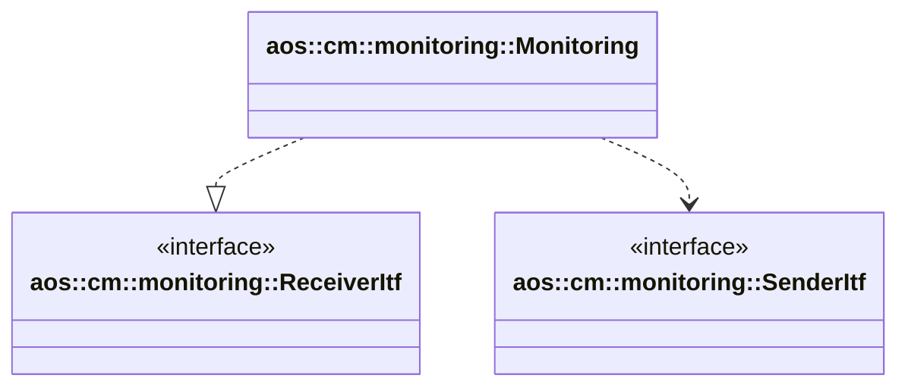

# Monitoring

Monitoring module receives monitoring data from SM's, buffers and aggregates them into suitable for Aos cloud messages.

It implements the following interfaces:

* [aos::cm::monitoring::ReceiverItf](itf/receiver.hpp) - receives SM's alerts.

It requires the following interfaces:

* [aos::cm::monitoring::SenderItf](itf/sender.hpp) - sends aggregated alert messages to Aos cloud.

