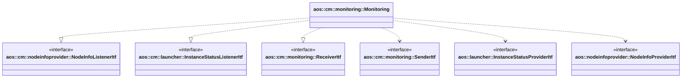

# Monitoring

Monitoring module receives monitoring data from SM's, buffers and aggregates them into suitable for Aos cloud messages.

It implements the following interfaces:

* [aos::cm::nodeinfoprovider::NodeInfoListenerItf](../nodeinfoprovider/itf/nodeinfoprovider.hpp) - receives
node info change events;
* [aos::cm::launcher::InstanceStatusListenerItf](../launcher/itf/instancestatusprovider.hpp) - receives
instance status change events;
* [aos::cm::monitoring::ReceiverItf](itf/receiver.hpp) - receives monitoring data.

It requires the following interfaces:

* [aos::cm::monitoring::SenderItf](itf/sender.hpp) - sends aggregated monitoring messages to Aos cloud;
* [aos::cm::launcher::InstanceStatusProviderItf](../launcher/itf/instancestatusprovider.hpp) - subscribes
the monitoring module to instance status changes;
* [aos::cm::nodeinfoprovider::NodeInfoProviderItf](../nodeinfoprovider/itf/nodeinfoprovider.hpp) - subscribes
the monitoring module to node info changes.

## Monitoring cache

The monitoring module maintains an internal cache used to aggregate monitoring data before sending it to the cloud.
Monitoring data is sent to the cloud at regular intervals, with the transmission period configured through a parameter.

If the cloud connection is lost, monitoring data cannot be sent, and the cache continues to grow until it reaches its
capacity. Once full, the oldest monitoring data is discarded to allocate space for the new data. As a result, when the
connection is restored, the most recent monitoring data is sent to the cloud.

## aos::cm::monitoring::Monitoring

### Init

Initializes the monitoring object instance.

### Start

Starts the monitoring object instance.

### Stop

Stops the monitoring object instance.

### OnMonitoringReceived

Accepts a monitoring message, stores it in the local cache for the future sending.

## OnNodeInfoChanged

Accepts node info change events, updates the local cache accordingly.

## OnInstancesStatusesChanged

Accepts instance status change events, updates the local cache accordingly.

### OnConnect

Notifies the monitoring object instance that the cloud connection is established.

### OnDisconnect

Notifies the monitoring object instance that the cloud connection is lost.
