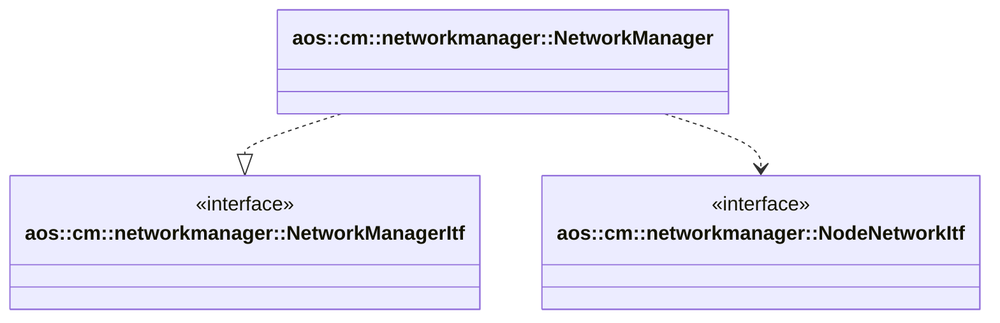

# Network manager

Network manager creates, updates and manages instances networks.

It implements the following interfaces:

* [aos::cm::networkmanager::NetworkManagerItf](itf/networkmanager.hpp) - implements main network manager functionality.

It requires the following interfaces:

* [aos::cm::networkmanager::NodeNetworkItf](itf/nodenetworkitf.hpp) - updates node networks.

