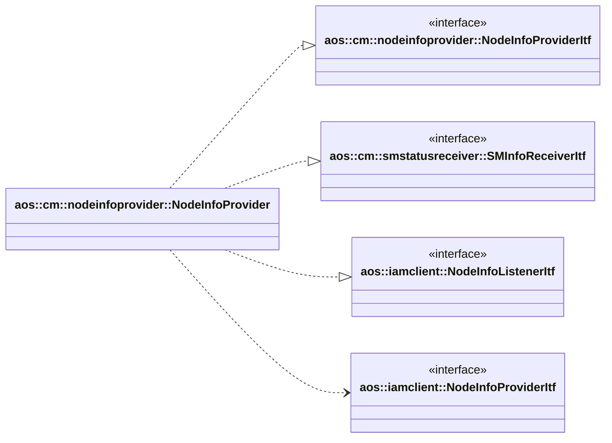

# Node info provider

Provides node information. Since node information is collected from two sources: IAM and SM, this module collects,
combines and provides combined node information for other CM modules.

It implements the following interfaces:

* [aos::cm::nodeinfoprovider::NodeInfoProviderItf](itf/nodeinfoprovider.hpp) - provides combined node info for
other modules;
* [aos::cm::smcontroller::SMInfoReceiverItf](itf/sminforeceiver.hpp) - receives SM statuses.
* [aos::iamclient::NodeInfoListenerItf](../../common/iamclient/itf/nodeinfoprovider.hpp) - listens for IAM node
info changes.

It requires the following interfaces:

* [aos::iamclient::NodeInfoProviderItf](../../common/iamclient/itf/nodeinfoprovider.hpp) -
retrieves IAM nodes information.

## Workflow

### Combining node info and SM info

At initialization `nodeinfoprovider` gets all nodes infos from IAM and caches them internally. When new SM info
received, it updates runtime and resource infos for the corresponding node info.

`nodeinfoprovider` may override node state received from IAM node info if this node has SM Aos service:

* if node state in IAM node info is `online` or `paused` and corresponding SM is not connected and SM info is not
  received then combined node state is set to `offline`;

* if node state in IAM node info is `online` or `paused` and corresponding SM is not connected or SM info is not
  received during configurable timeout then combined node state is set to `error`. It is changed to IAM node info state
  once the corresponding SM is connected and SM info is received.

## aos::cm::nodeinfoprovider::nodeinfoprovider

### GetAllNodeIDs

Returns all available node ID's.

### GetNodeInfo

Returns node info of specified node.

### SubscribeListener

Subscribes to node info change.

### UnsubscribeListener

Unsubscribes from node info change.

## aos::cm::smcontroller::SMInfoReceiverItf

## OnSMConnected

This method is called when corresponding SM connects to CM.

## OnSMDisconnected

This method is called when corresponding SM connects to CM.

## OnSMInfoReceived

This method is called when SM info is received.
