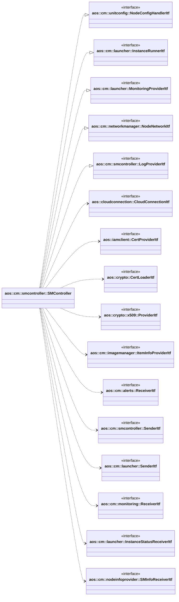

# SM controller

SM controller manages SM clients connections, sends and receives messages to and from SM clients.

It implements the following interfaces:

* [aos::cm::unitconfig::NodeConfigHandlerItf](../unitconfig/itf/nodeconfighandler.hpp) - updates nodes configs;
* [aos::cm::launcher::InstanceRunnerItf](../launcher/itf/instancerunner.hpp) - starts/stops instances on specified node;
* [aos::cm::launcher::MonitoringProviderItf](../launcher/itf/monitoringprovider.hpp) - gets average node and instances
  monitoring data;
* [aos::cm::networkmanager::NodeNetworkItf](../networkmanager/itf/nodenetwork.hpp) - updates network on specified node;
* [aos::cm::smcontroller::LogProviderItf](itf/logprovider.hpp) - requests log on specified node.

It requires the following interfaces:

* [aos::cloudconnection::CloudConnectionItf](../../common/cloudconnection/itf/cloudconnection.hpp) - subscribes to cloud
  connection events and sends connection state to connected SM;
* [aos::iamclient::CertProviderItf](../../common/iamclient/itf/certprovider.hpp) - provides certificates;
* [aos::crypto::CertLoaderItf](../../common/crypto/itf/certloader.hpp) - loads certificates;
* [aos::crypto::x509::ProviderItf](../../common/crypto/itf/x509provider.hpp) - provides crypto operations;
* [aos::cm::imagemanager::ItemInfoProviderItf](../imagemanager/itf/iteminfoprovider.hpp) - provides items info;
* [aos::cm::alerts::ReceiverItf](../alerts/itf/receiver.hpp) - receives alerts;
* [aos::cm::smcontroller::SenderItf](itf/sender.hpp) - sends logs;
* [aos::cm::launcher::SenderItf](../launcher/itf/sender.hpp) - sends env vars statuses;
* [aos::cm::monitoring::ReceiverItf](../monitoring/itf/receiver.hpp) - receives monitoring data;
* [aos::cm::launcher::InstanceStatusReceiverItf](../launcher/itf/instancestatusreceiver.hpp) - receives instances
  statuses;
* [aos::cm::nodeinfoprovider::SMInfoReceiverItf](../nodeinfoprovider/itf/sminforeceiver.hpp) - receives SM info.

