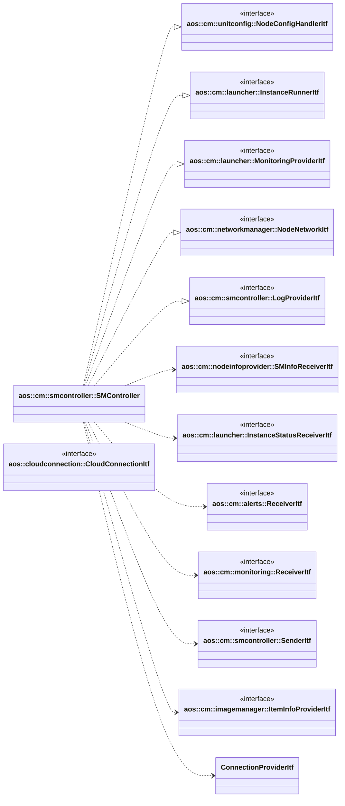

# SM controller

SM controller manages SM clients connections, sends and receives messages to and from SM clients.

It implements the following interfaces:

* [aos::cm::unitconfig::NodeConfigHandlerItf](../unitconfig/itf/nodeconfighandler.hpp) - updates nodes configs;
* [aos::cm::launcher::InstanceRunnerItf](../launcher/itf/instancerunner.hpp) - starts/stops instances on specified node;
* [aos::cm::launcher::MonitoringProviderItf](../launcher/itf/monitoringprovider.hpp) - gets average node and instances
  monitoring data;
* [aos::cm::networkmanager::NodeNetworkItf](../networkmanager/itf/nodenetwork.hpp) - updates network on specified node;
* [aos::cm::smcontroller::LogProviderItf](itf/logprovider.hpp) - requests log on specified node.

It requires the following interfaces:

* [aos::cm::nodeinfoprovider::SMInfoReceiverItf](../nodeinfoprovider/itf/sminforeceiver.hpp) - sends SM info message;
* [aos::cm::launcher::InstanceStatusReceiverItf](../launcher/itf/instancestatusreceiver.hpp) - sends instances statuses
  and override env vars statuses;
* [aos::cm::alerts::ReceiverItf](../alerts/itf/receiver.hpp) - sends alerts messages;
* [aos::cm::monitoring::ReceiverItf](../monitoring/itf/receiver.hpp) - sends instant monitoring messages;
* [aos::cm::smcontroller::SenderItf](itf/sender.hpp) - sends logs;
* [aos::cm::imagemanager::ItemInfoProviderItf](../imagemanager/itf/iteminfoprovider.hpp) - gets update items info;
* [aos::cloudconnection::CloudConnectionItf](../../common/cloudconnection/itf/cloudconnection.hpp) - gets
  connection state and sends it to connected SM.

