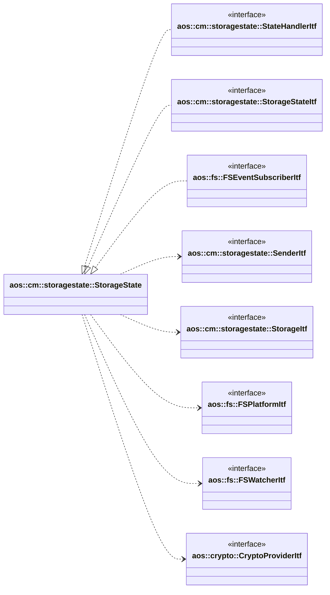
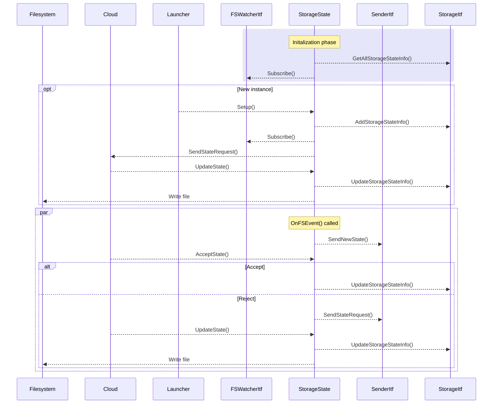

# Storage State

Storage state manages service instances storage partitions and state files.

It implements the following interfaces:

* [aos::fs::FSEventSubscriberItf](../../common/tools/fs.hpp) - handles file change events;
* [aos::cm::storagestate::StateHandlerItf](itf/statehandler.hpp) - handles state mutations;
* [aos::cm::storagestate::StorageStateItf](itf/storagestate.hpp) - manages service instances storage
partitions and state files.

It requires the following interfaces:

* [aos::cm::storagestate::SenderItf](itf/sender.hpp) - sends storage state messages;
* [aos::cm::storagestate::StorageItf](itf/storage.hpp) - manages metadata about storage/state partitions;
* [aos::fs::FSPlatformItf](../../common/tools/fs.hpp) - handle filesystem operations;
* [aos::fs::FSWatcherItf](../../common/tools/fs.hpp) - subscribes to file change events;
* [aos::crypto::HasherItf](../../common/crypto/itf/hasher.hpp) - computes state file checksum.



## Storage

The storagestate module provides each service instance with its own persistent storage folder if
[Storage Disk Limit](https://docs.aosedge.tech/docs/aos-cloud/components-view/service-default-quotas)
is set for the service. Storage disk limit value is used to set disk quota for the storage partition,
so disk quota must be enabled for the storage partition.

Storage folders are located separately from the service image in order to keep the storage between service updates.
The next pattern is used for storage folder paths:

```<StorageDir>/<ItemID>/<SubjectID>/<Instance>/```

where:

* `<StorageDir>` is the base storage directory set in the CM configuration file;
* `<ItemID>` is the service instance's ItemID;
* `<SubjectID>` is the service instance's SubjectID;
* `<Instance>` is the service instance's instance number.

## State

The storagestate module assigns each service instance a dedicated state file if a
[State Disk Limit](https://docs.aosedge.tech/docs/aos-cloud/components-view/service-default-quotas) is configured.
State disk limit value is used to set disk quota for the state partition, so disk quota must be enabled
for the state partition.

State files are located separately from the service image.
The next pattern is used for state file paths:

```<StateDir>/<ItemID>/<SubjectID>/<Instance>/state.dat```

where:

* `<StateDir>` is the base state directory set in the CM configuration file;
* `<ItemID>` is the service instance's ItemID;
* `<SubjectID>` is the service instance's SubjectID;
* `<Instance>` is the service instance's instance number.
* `state.dat` is the name of the state file.

The state file can be updated either by the service instance itself during runtime or via an UpdateState
message from AosCloud.

If a state file is missing or its checksum is invalid, storagestate sends a state request to AosCloud.
The state file is monitored for changes; when modified, the updated state is sent to AosCloud for validation.

Upon acceptance by AosCloud, the checksum of the new state becomes the valid reference.
If AosCloud rejects the new state, storagestate requests the latest valid state from the cloud.

storagestate maintains the checksum of each successfully updated state.
On startup, if an invalid checksum is detected, the state is considered corrupted and a state request is
sent to AosCloud.

## State changed flow

The next sequence diagram illustrates the interactions between components when the state file changes.



## aos::cm::storagestate::SenderItf

### SendStateRequest

Sends state request to the cloud.

### SendNewState

Sends new state to the cloud.

## aos::cm::storagestate::StorageItf

### AddStorageStateInfo

Adds storage/state for a service instance.

### RemoveStorageStateInfo

Removes storage/state for a service instance.

### GetAllStorageStateInfo

Retrieves all storage and state infos.

### GetStorageStateInfo

Gets info for a specific instance.

### UpdateStorageStateInfo

Updates storage state info.

## aos::cm::storagestate::StateItf

### UpdateState

Updates the state file for a service instance.

### AcceptState

Accepts the state file for a service instance.

## aos::cm::storagestate::StorageStateItf

### Setup

Sets up storage and state for a service instance.

### Cleanup

Cleans up storage and state for a service instance.

### Remove

Removes storage and state for a service instance.

### GetInstanceCheckSum

Returns the checksum of the state file for a service instance.

### GetTotalStateSize

Returns the total size of the state partition.

### GetTotalStorageSize

Returns the total size of the storage partition.

### IsSamePartition

Checks if storage and state are on the same partition.
