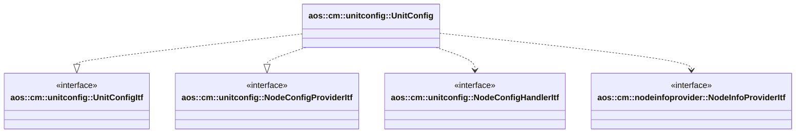

# Unit config

Unit config module updates unit config, populate it to all available nodes and provide node config for other modules.

It implements the following interfaces:

* [aos::cm::unitconfig::UnitconfigItf](itf/unitconfig.hpp) - implements main unit config functionality;
* [aos::cm::unitconfig::NodeConfigProviderItf](itf/nodeconfigprovider.hpp) - provides node config.

It requires the following interfaces:

* [aos::cm::unitconfig::NodeConfigHandlerItf](itf/nodeconfighandler.hpp) - updates node config on specified node;
* [aos::cm::nodeinfoprovider::NodeInfoProviderItf](../nodeinfoprovider/itf/nodeinfoprovider.hpp) - retrieves node info
  and receives node state updates.

