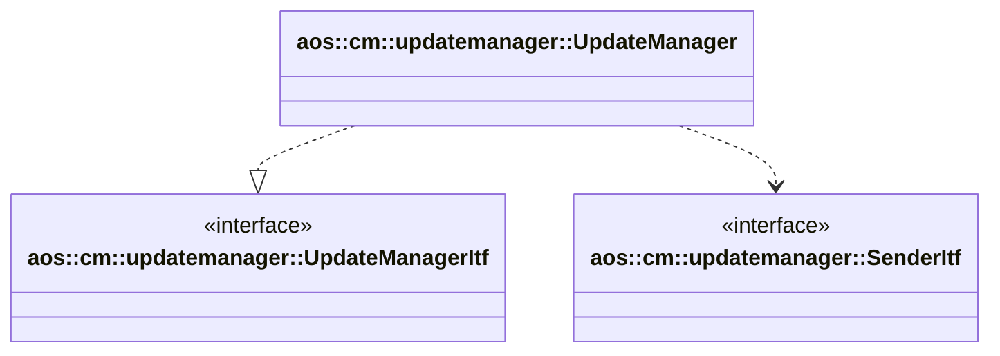

# Update manager

Update manager processes desired status from Aos cloud, downloads update images, and schedules update according to
update policy.

It implements the following interfaces:

* [aos::cm::updatemanager::UpdateManagerItf](itf/updatemanager.hpp) - implements main update manager functionality.

It requires the following interfaces:

* [aos::cm::updatemanager::SenderItf](itf/sender.hpp) - sends unit status message to Aos cloud.

