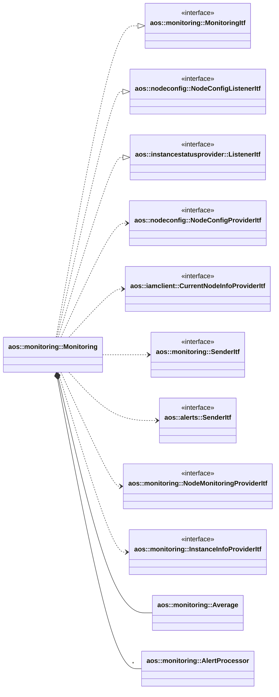

# Monitoring

Monitoring provides node and instances monitoring data.

It implements the following interfaces:

* [aos::monitoring::MonitoringItf](itf/monitoring.hpp) - provides average monitoring data.
* [aos::nodeconfig::NodeConfigListenerItf](../nodeconfig/itf/nodeconfigprovider.hpp) - to listen
for node config to apply latest system alert rules.
* [aos::instancestatusprovider::ListenerItf](../instancestatusprovider/itf/instancestatusprovider.hpp) - to listen
for instance status changes to start/stop monitoring instances.

It uses the following interfaces:

* [aos::nodeconfig::NodeConfigProviderItf](../nodeconfig/itf/nodeconfigprovider.hpp) - to get current node config
and to subscribe for node config changes;
* [aos::iamclient::CurrentNodeInfoProviderItf](../iamclient/itf/currentnodeinfoprovider.hpp) - to get
current node info;
* [aos::monitoring::SenderItf](itf/sender.hpp) - to send monitoring data;
* [aos::alerts::SenderItf](../alerts/itf/sender.hpp) - to send system/instance quota alerts;
* [aos::monitoring::NodeMonitoringProviderItf](itf/nodemonitoringprovider.hpp) - to retrieve node monitoring data;
* [aos::monitoring::InstanceInfoProviderItf](itf/instanceinfoprovider.hpp) - to retrieve instance monitoring data,
  monitoring params and instance states. This interface is optional and if not provided monitoring module processes and
  sends only node monitoring data. This interface includes the following interfaces:
  * [aos::monitoring::InstanceMonitoringProviderItf](itf/instanceinfoprovider.hpp) - to retrieve instance monitoring
    data;
  * [aos::monitoring::InstanceParamsProviderItf](itf/instanceparamsprovider.hpp) - to get instance monitoring params;
  * [aos::instancestatusprovider::ProviderItf](../instancestatusprovider/itf/instancestatusprovider.hpp) - to monitor
    instance states.

It uses the following internal components:

* [aos::monitoring::Average](average.hpp) - calculates average monitoring data over a period of time;
* [aos::monitoring::AlertProcessor](alertprocessor.hpp) - processes monitoring data against alert rules
and generates alerts.

## Monitoring data aggregation

The monitoring module aggregates monitoring data over a configurable time window to provide average
monitoring data. The aggregation is performed using the [aos::monitoring::Average](average.hpp) component.
The average monitoring data can be retrieved using the `GetAverageMonitoringData` method of the
[aos::monitoring::MonitoringItf](itf/monitoring.hpp) interface.

## Alerts processing

The monitoring module processes monitoring data against alert rules to generate alerts.
The alert processing is performed using the [aos::monitoring::AlertProcessor](alertprocessor.hpp) component.
The alert processors are created based on the alert rules defined in the node config for system alerts
and in the instance config for instance alerts. The monitoring module maintains separate alert processors for system
and instance alerts. The alert processors are updated whenever the node config or instance config changes.
The generated alerts are sent using the [aos::alerts::SenderItf](../alerts/itf/sender.hpp) interface.

## Instance monitoring

The monitoring module can monitor instances based on their statuses.
When an instance status changes to a running state, the monitoring module starts watching the instance
and creates alert processors for instance alerts based on the instance config.
When an instance status changes to a stopped state, the monitoring module stops watching the instance
and removes the associated alert processors.

The monitoring module uses the
[aos::instancestatusprovider::ListenerItf](../instancestatusprovider/itf/instancestatusprovider.hpp)
interface to listen for instance status changes and manage the monitoring of instances accordingly.
