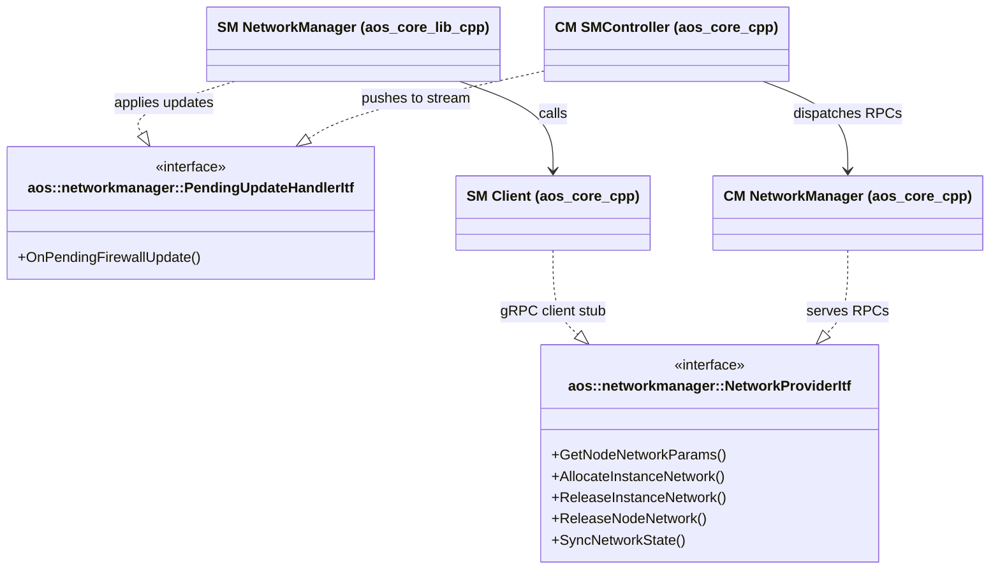
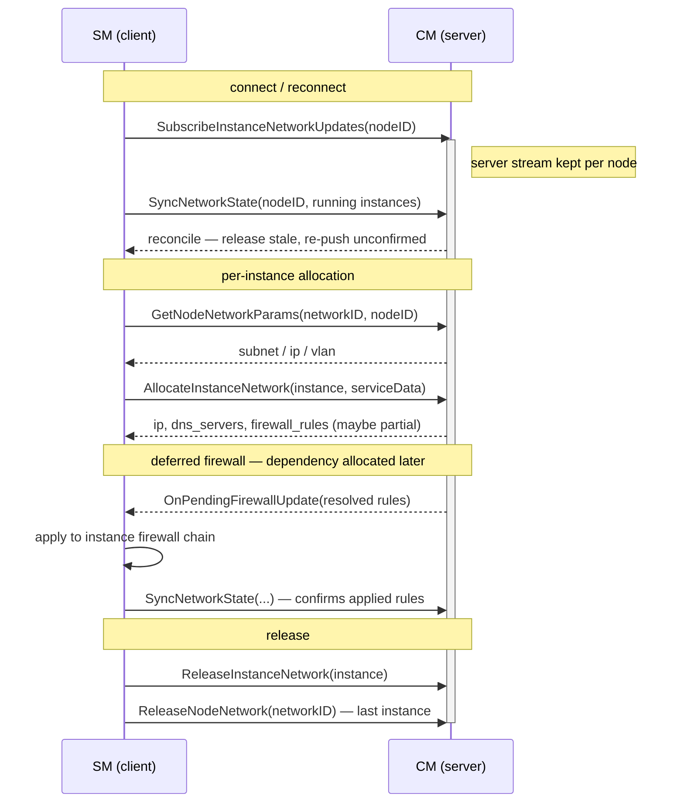

# Network Manager

This document describes the shared network-manager interfaces and types in the
AOS Core Library `common` layer. They define the **contract between the Cloud
Manager (CM) and the Service Manager (SM)** for allocating and releasing network
resources and for delivering deferred firewall updates.

These types live in `common` because both sides depend on them:

- **SM side** — SM is the gRPC **client**. SM's network manager calls CM through
  [NetworkProviderItf][networkprovider-itf] and implements
  [PendingUpdateHandlerItf][pendingupdatehandler-itf] to receive and apply
  resolved firewall rules.
- **CM side** — CM is the gRPC **server**. CM's network manager implements
  [NetworkProviderItf][networkprovider-itf] to serve allocation requests, and
  CM's SM controller implements [PendingUpdateHandlerItf][pendingupdatehandler-itf]
  to push resolved firewall updates back to SM over the server stream.

On the wire this contract is the `servicemanager.v5.NetworkService` gRPC service
(in [`aos_core_api`][network-proto]). The implementations that bridge the
interfaces to gRPC live in `aos_core_cpp` ([SM client][cpp-smclient] and
[CM SM controller][cpp-smcontroller]); CM's allocation logic lives in the
[CM network manager][cpp-cm-net].

## Data types

The shared payloads (in `core/common/types/network.hpp`) mirror the proto
messages:

- `NetworkParams` — node-level subnet / IP / VLAN ID for a network.
- `InstanceNetworkAllocation` — the result of an instance allocation: subnet,
  IP, DNS servers and the resolved `FirewallRule`s.
- `FirewallRule` — a single allow rule (`dstIP` / `dstPort` / `proto` / `srcIP`).
- `UpdateItemNetworkParams` — the per-instance service data sent on allocation
  (hosts, allowed connections, exposed ports).
- `InstanceNetworkStateInfo` — one instance's reconciliation snapshot
  (instance ident, network ID, IP, applied firewall rules) used by
  `SyncNetworkState`.

## Interfaces

### NetworkProviderItf

The SM → CM call surface (`aos::networkmanager::NetworkProviderItf`). Each method
maps one-to-one to a `NetworkService` unary RPC:

- `GetNodeNetworkParams(networkID, nodeID, result)` — node network parameters
  (subnet / IP / VLAN) for a network on a node.
- `AllocateInstanceNetwork(instance, networkID, nodeID, serviceData, result)` —
  allocate an instance's network. Returns the IP, DNS servers and firewall
  rules. If a referenced peer instance is not yet allocated, the returned rules
  are **partial** (the deferred rules follow later over the stream).
- `ReleaseInstanceNetwork(instance, nodeID)` — release an instance's resources.
- `ReleaseNodeNetwork(networkID, nodeID)` — release node-level resources for a
  network (called when the last instance leaves).
- `SyncNetworkState(nodeID, instances)` — send SM's current per-instance state
  so CM can reconcile (release what SM no longer runs, confirm / re-push pending
  firewall updates). Sent on every (re)connect.

### PendingUpdateHandlerItf

The CM → SM notification surface for deferred firewall updates
(`aos::networkmanager::PendingUpdateHandlerItf`), backed by the
`SubscribeInstanceNetworkUpdates` server stream:

- `OnPendingFirewallUpdate(nodeID, update)` — invoked when CM resolves pending
  firewall rules for an instance. The `PendingFirewallUpdate` carries the
  instance ident and the resolved `FirewallRule`s.
  - **CM side**: CM's network manager raises this; CM's SM controller forwards
    it down the node's stream.
  - **SM side**: SM's network manager applies the rules to that instance's
    firewall chain only — no veth re-attach or other steps.

## SM ↔ CM flow

On connect, SM opens the update stream and reconciles its state; thereafter
allocation is per-instance, with deferred firewall rules arriving asynchronously
over the stream until SM confirms them on the next sync.

## Deferred firewall rules

When an instance has an `allowedConnection` to another instance that CM has not
allocated yet, `AllocateInstanceNetwork` returns only the rules CM can resolve
and records the unresolved connection (persisted in CM's DB). When the
dependency is later allocated, CM resolves the rule and calls
`PendingUpdateHandlerItf::OnPendingFirewallUpdate`, which is delivered to SM over
the `SubscribeInstanceNetworkUpdates` stream. SM applies the resolved rules to
that instance's firewall chain and reports them back on the next
`SyncNetworkState`; only then does CM consider the pending entry confirmed and
drop it from the DB. This keeps the update durable across SM/CM restarts —
unconfirmed updates are re-pushed after reconnect.

[networkprovider-itf]: itf/networkprovider.hpp
[pendingupdatehandler-itf]: itf/pendingupdatehandler.hpp
[network-proto]: https://github.com/aosedge/aos_core_api/blob/main/proto/servicemanager/v5/network.proto
[cpp-smclient]: https://github.com/aosedge/aos_core_cpp/tree/main/src/sm/smclient
[cpp-smcontroller]: https://github.com/aosedge/aos_core_cpp/tree/main/src/cm/smcontroller
[cpp-cm-net]: https://github.com/aosedge/aos_core_cpp/tree/main/src/cm/networkmanager/networkmanager.md
