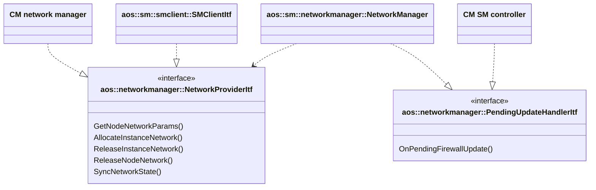
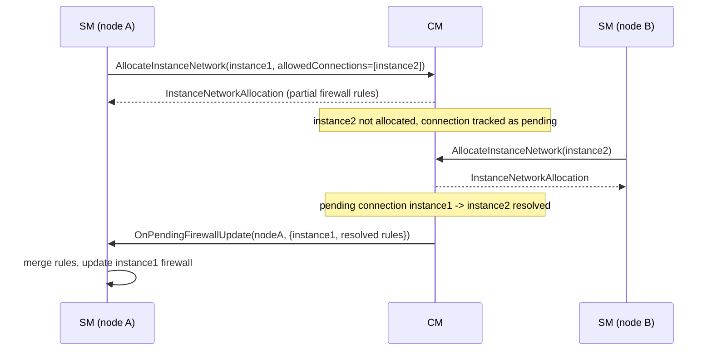

# Network manager

This document describes the network manager interfaces shared between CM (Communication Manager) and SM (Service
Manager). They define the contract for allocating and releasing network resources, synchronizing network state on
(re)connect and delivering deferred firewall rule updates.

The overall networking architecture is described in the public documentation:

- [Networking overview][arch-overview];
- [Per-instance network lifecycle][arch-lifecycle].

The SM side implementation of this contract is described in [SM network manager][sm-networkmanager].

[arch-overview]: https://github.com/aosedge/public-docs/blob/main/docs/aos-core/14-network/index.md
[arch-lifecycle]: https://github.com/aosedge/public-docs/blob/main/docs/aos-core/14-network/per-instance-networking.md
[sm-networkmanager]: ../../sm/networkmanager/networkmanager.md

## Overview

CM is the allocator: it hands out subnets, IP addresses and per-instance firewall policy and keeps them consistent
across the unit. SM is the runtime owner: it asks CM what an instance network should look like and builds it on the
node.

The interfaces are placed in `common` because both sides depend on them:

- [aos::networkmanager::NetworkProviderItf](itf/networkprovider.hpp) - SM -> CM requests. On the SM side it is
  implemented by SM client, which forwards the calls to CM over the network service. On the CM side it is implemented
  by CM network manager;
- [aos::networkmanager::PendingUpdateHandlerItf](itf/pendingupdatehandler.hpp) - CM -> SM notifications. On the CM
  side it is implemented by SM controller, which pushes the update to the node over the stream. On the SM side it is
  implemented by SM network manager, which applies the update.

```mermaid
classDiagram
    direction TB

    class CMNetworkManager ["CM network manager"] {
    }
    class SMClient ["aos::sm::smclient::SMClientItf"] {
    }
    class SMNetworkManager ["aos::sm::networkmanager::NetworkManager"] {
    }
    class CMSMController ["CM SM controller"] {
    }

    class NetworkProviderItf ["aos::networkmanager::NetworkProviderItf"] {
        <<interface>>
        GetNodeNetworkParams()
        AllocateInstanceNetwork()
        ReleaseInstanceNetwork()
        ReleaseNodeNetwork()
        SyncNetworkState()
    }
    class PendingUpdateHandlerItf ["aos::networkmanager::PendingUpdateHandlerItf"] {
        <<interface>>
        OnPendingFirewallUpdate()
    }

    %% SM -> CM requests
    CMNetworkManager ..|> NetworkProviderItf
    SMClient ..|> NetworkProviderItf
    SMNetworkManager ..> NetworkProviderItf

    %% CM -> SM notifications
    SMNetworkManager ..|> PendingUpdateHandlerItf
    CMSMController ..|> PendingUpdateHandlerItf
```

## aos::networkmanager::NetworkProviderItf

Network provider interface used by SM to request network resources from CM.

### GetNodeNetworkParams

Returns node network parameters (`NetworkParams`: subnet, bridge IP, VLAN ID) for the given network and node. SM calls
it once per network when the first instance of that network is created on the node.

### AllocateInstanceNetwork

Allocates network resources for an instance on CM. SM passes the instance identifier, network ID, node ID and the
service network data (`UpdateItemNetworkParams`: hosts, exposed ports, allowed connections). CM returns the allocated
parameters (`InstanceNetworkAllocation`: IP, subnet, DNS servers, firewall rules).

If some of the allowed connections point to instances that are not allocated yet, CM returns partial firewall rules
and delivers the missing ones later (see [Deferred firewall rules](#deferred-firewall-rules)).

### ReleaseInstanceNetwork

Releases instance network resources on CM. SM calls it when the instance network is released.

### ReleaseNodeNetwork

Releases node network resources on CM. SM calls it when the last instance of the network on the node is released.

### SyncNetworkState

Sends the current network state of the node to CM. SM calls it every time it connects or reconnects to CM and passes
the running instances (`InstanceNetworkStateInfo`: instance identifier, network ID, IP, firewall rules). CM reconciles
its allocation view with what is actually running on the node, so the central allocation and the on-node state do
not drift apart after restarts or connection interruptions.

## aos::networkmanager::PendingUpdateHandlerItf

Handler interface for deferred firewall update notifications.

### OnPendingFirewallUpdate

Called when pending firewall rules are resolved for an instance. The update (`PendingFirewallUpdate`) contains the
instance identifier and the firewall rules that have just become resolvable, not the whole rule set of the instance.
A resolved connection is delivered once, so the receiver has to merge the rules into what it already holds.

## Deferred firewall rules

When an instance has allowed connections to another instance that is not allocated yet, CM returns partial firewall
rules from `AllocateInstanceNetwork` (without the missing dependency) and tracks the missing connections as pending.
When the dependency instance is later allocated, CM resolves the pending rules and pushes them to the node via
`PendingUpdateHandlerItf::OnPendingFirewallUpdate`. SM merges the received rules and updates only the firewall of the
affected instance, without rebuilding the rest of its network.

```mermaid
sequenceDiagram
    participant SM_A as SM (node A)
    participant CM
    participant SM_B as SM (node B)

    SM_A ->> CM: AllocateInstanceNetwork(instance1, allowedConnections=[instance2])
    CM -->> SM_A: InstanceNetworkAllocation (partial firewall rules)
    Note over CM: instance2 not allocated, connection tracked as pending

    SM_B ->> CM: AllocateInstanceNetwork(instance2)
    CM -->> SM_B: InstanceNetworkAllocation
    Note over CM: pending connection instance1 -> instance2 resolved

    CM ->> SM_A: OnPendingFirewallUpdate(nodeA, {instance1, resolved rules})
    SM_A ->> SM_A: merge rules, update instance1 firewall
```

## Types

The data types used by the interfaces are defined in [core/common/types/network.hpp](../types/network.hpp):

- `NetworkParams` - node network parameters: network ID, subnet, bridge IP, VLAN ID;
- `UpdateItemNetworkParams` - service network data passed on allocation: hosts, allowed connections, exposed ports;
- `InstanceNetworkAllocation` - instance parameters allocated by CM: network ID, subnet, IP, DNS servers, firewall
  rules;
- `FirewallRule` - a single allow rule: destination IP, destination port, protocol, source IP;
- `InstanceNetworkStateInfo` - running instance state reported on sync: instance identifier, network ID, IP, firewall
  rules;
- `PendingFirewallUpdate` (defined in [itf/pendingupdatehandler.hpp](itf/pendingupdatehandler.hpp)) - instance
  identifier and the resolved firewall rules.
