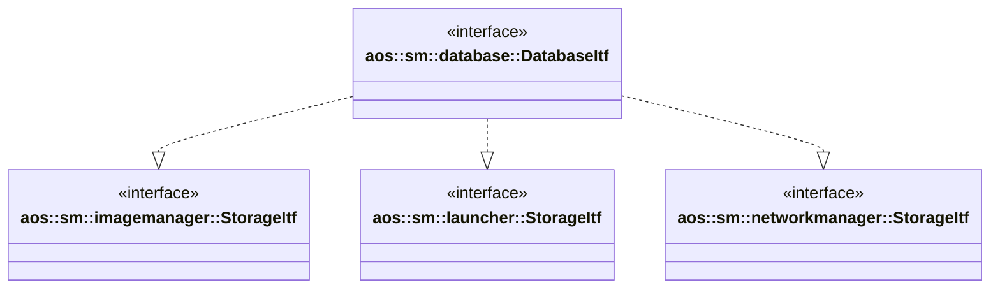

# Database

The database module provides persistent storage for various SM modules. It implements storage interfaces for the
following modules:

- [aos::sm::imagemanager::StorageItf](../imagemanager/itf/storage.hpp) - image manager storage interface;
- [aos::sm::launcher::StorageItf](../launcher/itf/storage.hpp) - launcher storage interface.
- [aos::sm::networkmanager::StorageItf](../networkmanager/itf/storage.hpp) - network manager storage interface;

