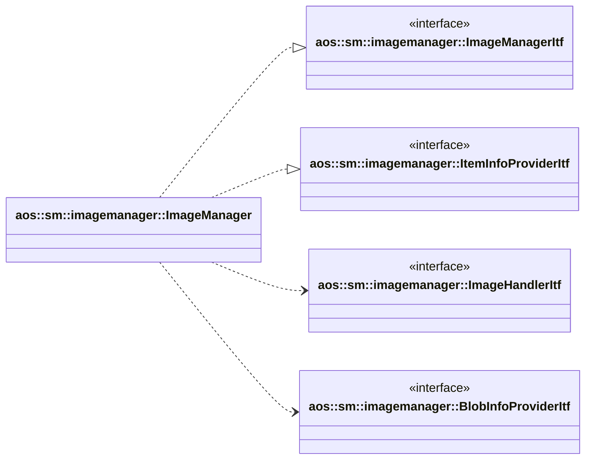

# Image manager

Image manager installs, removes and manages update items on SM side.

It implements the following interfaces:

* [aos::sm::imagemanager::ImageManagerItf](itf/imagemanager.hpp) - installs, removes update items;
* [aos::sm::imagemanager::ItemInfoProviderItf](itf/iteminfoprovider.hpp) - provides info about installed blobs, layers.

It requires the following interfaces:

* [aos::sm::imagemanager::ImageHandlerItf](itf/imagehandler.hpp) - performs platform dependant layers unpacking;
* [aos::sm::imagemanager::BlobInfoProviderItf](itf/blobinfoprovider.hpp) - gets blob information (URL).

