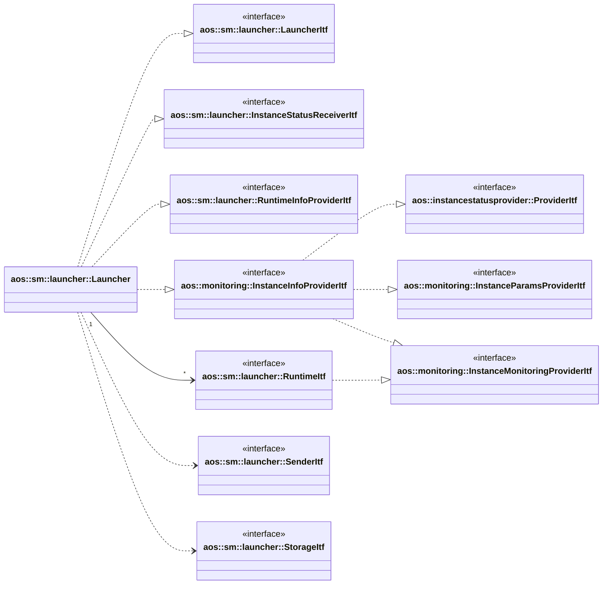
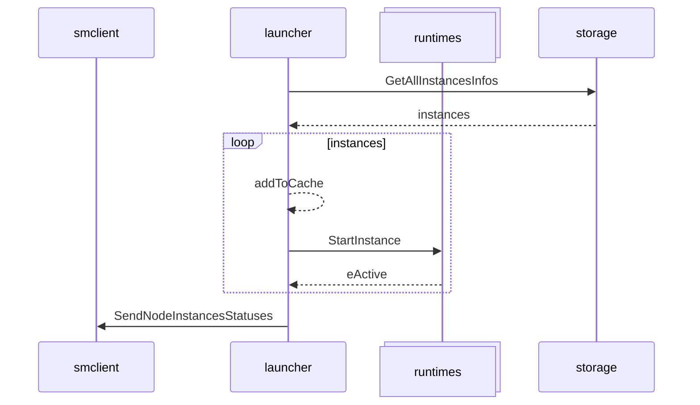
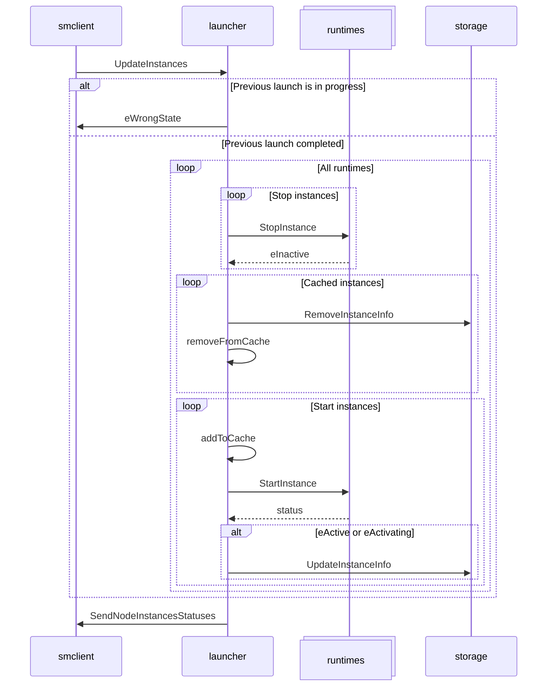

# Launcher

Launcher module aims to launch different types of Aos items, such as Aos services, components etc. This module
is responsible for launching items with respect to runtime dependencies on node start
and supervising items at runtime.

It uses different runtimes to run appropriate update item.

It implements the following interfaces:

* [aos::sm::launcher::LauncherItf](itf/launcher.hpp) - implements main launcher functionality to update Aos items;
* [aos::sm::launcher::InstanceStatusReceiverItf](itf/instancestatusreceiver.hpp) - to receive instances statuses
  from runtimes;
* [aos::sm::launcher::RuntimeInfoProviderItf](itf/runtimeinfoprovider.hpp) - to provide runtime info.
* [aos::monitoring::InstanceInfoProviderItf](../../common/monitoring/itf/instanceinfoprovider.hpp) - provides
  instance info: monitoring parameters, monitoring data, instance statuses. Also, it's capable of managing instance
  status events subscription and notifications and inherits the following interfaces:
  * [aos::instancestatusprovider::ProviderItf](../../common/instancestatusprovider/itf/instancestatusprovider.hpp) -
    providers instance statuses;
  * [aos::monitoring::InstanceParamsProviderItf](../../common/monitoring/itf/instanceparamsprovider.hpp) - provides
    instance monitoring parameters;
  * [aos::monitoring::InstanceMonitoringProviderItf](../../common/monitoring/itf/instancemonitoringprovider.hpp) -
    provides instance monitoring data.

It requires the following interfaces:

* [aos::sm::launcher::RuntimeItf](itf/runtime.hpp) - launch different kind of items on different runtimes, and
  provides instance monitoring data (implements `aos::monitoring::InstanceMonitoringProviderItf` interface);
* [aos::sm::launcher::StorageItf](itf/storage.hpp) - persistently store current instances;
* [aos::sm::launcher::SenderItf](itf/sender.hpp) - sends node and updated instances statuses.

## Initialization

On SM start, launcher gets items that should be started on this node from the storage, checks current item status and
starts or stops corresponding item depends on its status. After all items updated, it sends node instances status using
`InstanceStatusSenderItf`.

Launcher processes instances in parallel using a thread pool.

## Update instances

On update instances request, launcher checks if previous launch is still in progress. If so, it returns
`eWrongState` error. Otherwise, it stops all running instances, updates storage and local cache to reflect
new instances, and starts required instances. After all instances updated,
it sends node instances status using `InstanceStatusSenderItf`.

Launcher processes instances in parallel using a thread pool.

## aos::sm::launcher::InstanceStatusReceiverItf

### OnInstancesStatusesReceived

Receive instances statuses.

### RebootRequired

Marks runtime for reboot. Reboot will be performed after current launch is completed.

## aos::sm::launcher::InstanceStatusSenderItf

### SendNodeInstancesStatuses

Sends node instances statuses once update is completed.

### SendUpdateInstancesStatuses

Propagates updated instances statuses received from runtimes.

## aos::sm::launcher::LauncherItf

Implements main launcher functionality to start and stop node instances.

### UpdateInstances

Start and stop node instances.

## aos::sm::launcher::RebooterItf

### Reboot

Reboots the system.

## aos::sm::launcher::UpdateCheckerItf

### Check

Checks if update succeeded.
