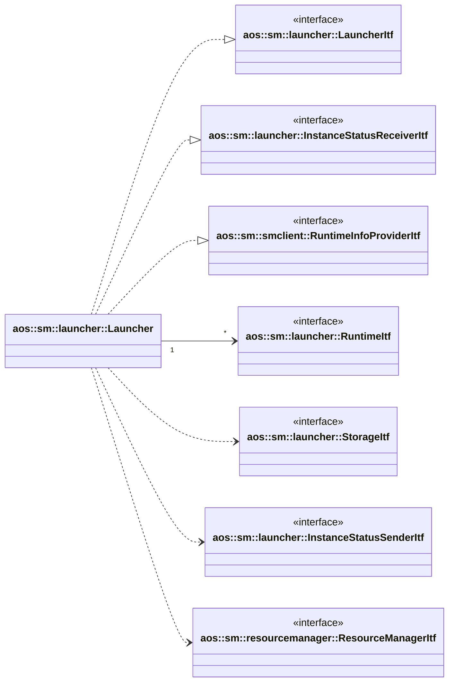
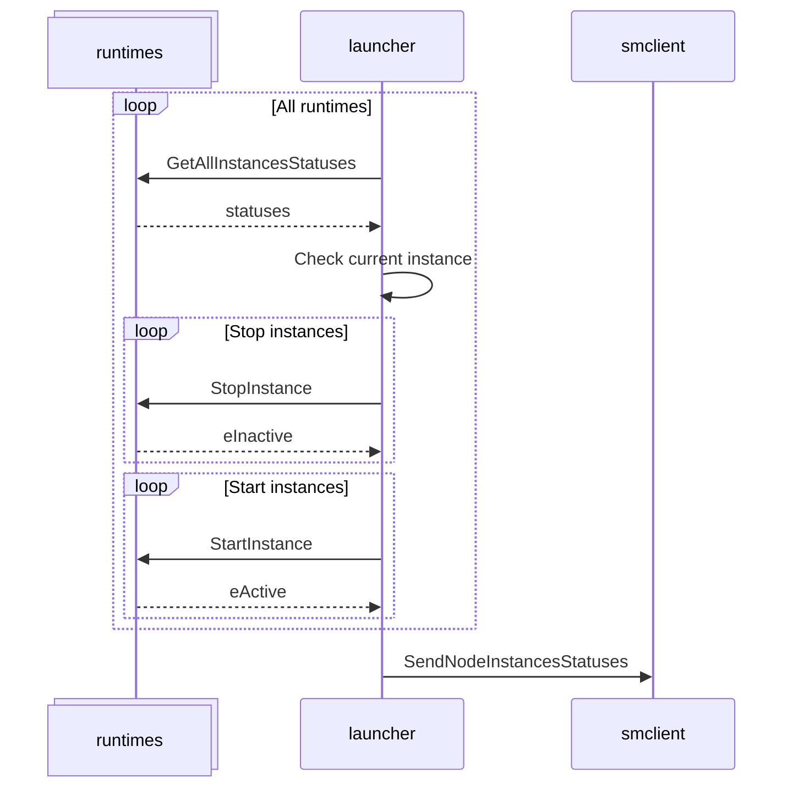
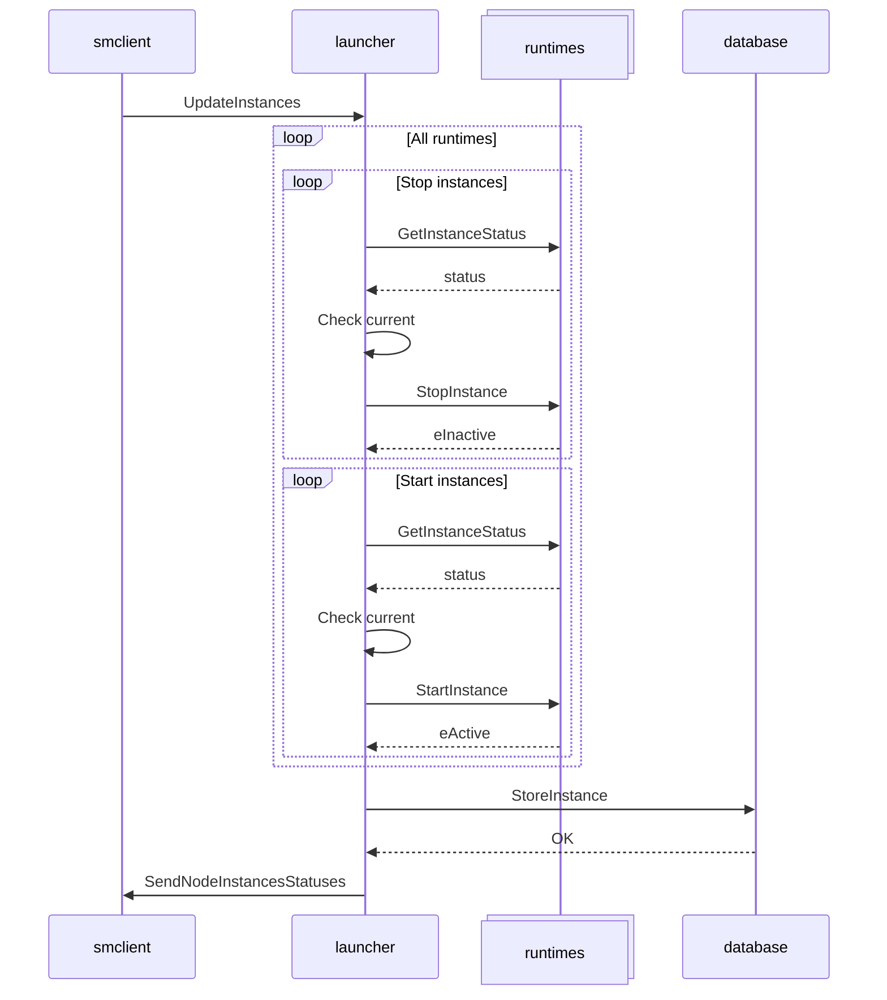

# Launcher

Launcher module aims to launch different types of Aos items, such as Aos services, components etc. This module
responsible to launch items with respect of runtime dependencies on node start and supervise items in runtime.

It uses different runtimes to run appropriate update item.

It implements the following interfaces:

* [aos::sm::launcher::LauncherItf](itf/launcher.hpp) - implements main launcher functionality to update Aos items;
* [aos::sm::launcher::InstanceStatusReceiverItf](itf/runtime.hpp) - to receive instances statuses from runtimes;
* [aos::sm::smclient::RuntimeInfoProviderItf](../smclient/itf/runtimeinfoprovider.hpp) - to provider runtimes info.

It requires the following interfaces:

* [aos::sm::launcher::RuntimeItf](itf/runtime.hpp) - launch different kind of items on different runtimes;
* [aos::sm::launcher::StorageItf](itf/storage.hpp) - persistently store current instances;
* [aos::sm::launcher::InstanceStatusSenderItf](itf/instancestatussender.hpp) - sends node and updated instances
  statuses;
* [aos::sm::resourcemanager::ResourceManagerItf](../resourcemanager/itf/resourcemanager.hpp) - to allocate node
  resources.

## Initialization

On SM start, launcher gets items that should be started on this node from the storage, checks current item status and
starts or stops corresponding item depends on its status. After all items updated, it sends node instances status using
`InstanceStatusSenderItf`.

Launcher processes instances in parallel using a thread pool.

## aos::sm::launcher::LauncherItf

Implements main launcher functionality to start and stop node instances.

### UpdateInstances

Start and stop node instances.

