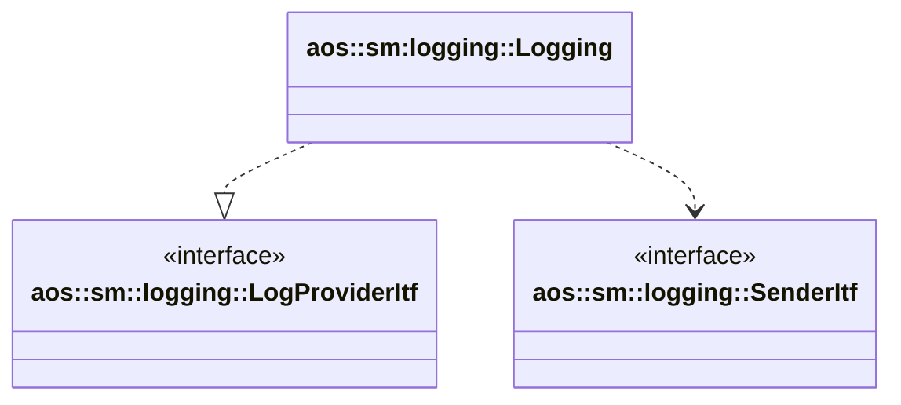

# Logging

Provides system and instances logs.

It implements the following interfaces:

* [aos::sm::logging::LogProviderItf](itf/logprovider.hpp) - collects and compresses system and instances logs.

It uses the following interfaces:

* [aos::sm::logging::SenderItf](itf/sender.hpp) - sends collected logs to CM.

