# Network manager

Network manager creates, updates and manages instances networks using CNI plugins. It handles network
namespace creation, IP address allocation, traffic monitoring, and CNI plugin configuration for service
instances.

## Functionality

The network manager provides the following functionality:

### Network management

- **UpdateNetworks**: Updates the list of available networks based on network parameters. Creates new
  networks (bridges, VLANs) or removes existing ones as needed. Manages network storage and interface
  configuration.

### Instance network operations

- **AddInstanceToNetwork**: Adds a service instance to a specific network. This method:
  - Creates a network namespace for the instance
  - Configures CNI plugins (bridge, firewall, bandwidth, DNS)
  - Allocates an IP address from the network subnet
  - Sets up network interfaces and routing
  - Configures traffic shaping (ingress/egress bandwidth limits)
  - Creates host files and resolv.conf for DNS resolution
  - Starts traffic monitoring for the instance

- **RemoveInstanceFromNetwork**: Removes an instance from a network. This method:
  - Stops traffic monitoring for the instance
  - Executes CNI plugin DEL command to tear down network configuration
  - Removes network namespace
  - Cleans up host files and network cache

- **GetInstanceIP**: Retrieves the IP address assigned to an instance on a specific network.

- **GetNetnsPath**: Returns the filesystem path to the network namespace for a given instance.

### Traffic monitoring

- **GetInstanceTraffic**: Returns the current input and output traffic statistics for a specific
  instance.

- **GetSystemTraffic**: Returns the aggregate input and output traffic statistics for all instances.

- **SetTrafficPeriod**: Configures the traffic monitoring period (minute, hour, day, month, year) for
  traffic accounting.

## Interfaces

It implements the following interfaces:

- [aos::sm::networkmanager::NetworkManagerItf][networkmanager-itf] - implements main network manager
  functionality.

It requires the following interfaces:

- [aos::sm::networkmanager::StorageItf][storage-itf] - stores and retrieves network configuration data.
- [aos::sm::cni::CNIItf][cni-itf] - provides CNI plugin management functionality.
- [aos::sm::networkmanager::TrafficMonitorItf][trafficmonitor-itf] - monitors network traffic for instances.
- [aos::sm::networkmanager::NamespaceManagerItf][namespacemanager-itf] - manages network namespaces.
- [aos::sm::networkmanager::InterfaceManagerItf][interfacemanager-itf] - manages network interfaces.
- [aos::sm::networkmanager::InterfaceFactoryItf][interfacefactory-itf] - creates network interfaces (bridges,
  VLANs).
- [aos::common::crypto::RandomItf][random-itf] - generates random values.

[networkmanager-itf]: https://github.com/aosedge/aos_core_lib_cpp/blob/feature_unification/src/core/sm/networkmanager/itf/networkmanager.hpp
[storage-itf]: https://github.com/aosedge/aos_core_lib_cpp/blob/feature_unification/src/core/sm/networkmanager/itf/storage.hpp
[cni-itf]: https://github.com/aosedge/aos_core_lib_cpp/blob/feature_unification/src/core/sm/networkmanager/itf/cni.hpp
[trafficmonitor-itf]: https://github.com/aosedge/aos_core_lib_cpp/blob/feature_unification/src/core/sm/networkmanager/itf/trafficmonitor.hpp
[namespacemanager-itf]: https://github.com/aosedge/aos_core_lib_cpp/blob/feature_unification/src/core/sm/networkmanager/itf/namespacemanager.hpp
[interfacemanager-itf]: https://github.com/aosedge/aos_core_lib_cpp/blob/feature_unification/src/core/sm/networkmanager/itf/interfacemanager.hpp
[interfacefactory-itf]: https://github.com/aosedge/aos_core_lib_cpp/blob/feature_unification/src/core/sm/networkmanager/itf/interfacefactory.hpp
[random-itf]: https://github.com/aosedge/aos_core_lib_cpp/blob/feature_unification/src/core/common/crypto/itf/rand.hpp

```mermaid
classDiagram
    class NetworkManager ["aos::sm::networkmanager::NetworkManager"] {
    }

    class NetworkManagerItf ["aos::sm::networkmanager::NetworkManagerItf"] {
        <<interface>>
    }

    class StorageItf ["aos::sm::networkmanager::StorageItf"] {
        <<interface>>
    }

    class CNIItf ["aos::sm::cni::CNIItf"] {
        <<interface>>
    }

    class TrafficMonitorItf ["aos::sm::networkmanager::TrafficMonitorItf"] {
        <<interface>>
    }

    class NamespaceManagerItf ["aos::sm::networkmanager::NamespaceManagerItf"] {
        <<interface>>
    }

    class InterfaceManagerItf ["aos::sm::networkmanager::InterfaceManagerItf"] {
        <<interface>>
    }

    class InterfaceFactoryItf ["aos::sm::networkmanager::InterfaceFactoryItf"] {
        <<interface>>
    }

    class RandomItf ["aos::common::crypto::RandomItf"] {
        <<interface>>
    }

    NetworkManager ..|> NetworkManagerItf

    NetworkManager ..> StorageItf
    NetworkManager ..> CNIItf
    NetworkManager ..> TrafficMonitorItf
    NetworkManager ..> NamespaceManagerItf
    NetworkManager ..> InterfaceManagerItf
    NetworkManager ..> InterfaceFactoryItf
    NetworkManager ..> RandomItf
```

