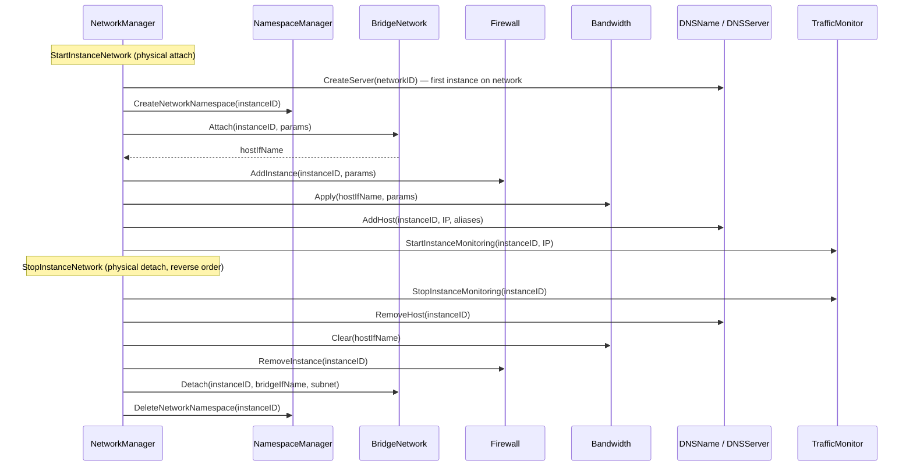
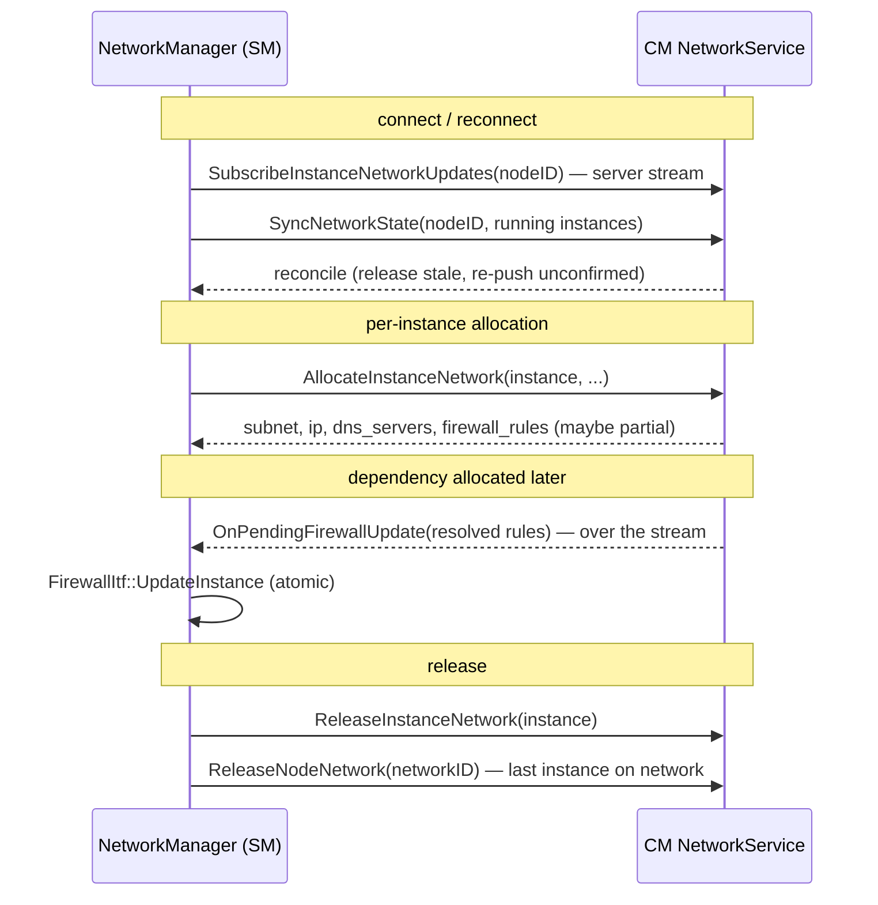

# Network manager

The Service Manager `NetworkManager` creates, starts, stops and releases
per-instance networks. It orchestrates the whole lifecycle **purely through
interfaces** — the concrete, platform-specific implementations (native veth /
bridge / VLAN, an nftables firewall, tc bandwidth shaping and per-network
`dnsmasq`) live in the [`aos_core_cpp`][cpp-sm-net] repository. This module owns
the sequencing, the in-memory/DB state and the communication with the Cloud
Manager (CM); it never touches Linux primitives directly.

The lifecycle is split into **logical** and **physical** halves so that an
instance can be (re)started while SM is offline and so that reboot recovery is
clean:

- **logical** operations talk to CM (over the [NetworkProviderItf][networkprovider-itf]
  gRPC contract) and persist to the DB. They allocate the subnet/IP, the DNS
  servers and the firewall rules, but create no interfaces.
- **physical** operations are local only (no CM calls). They build the bridge /
  VLAN, the namespace, the veth, the firewall chain, the shaping and the DNS
  host entry from the parameters already stored in the DB.

## Interfaces

It implements [aos::sm::networkmanager::NetworkManagerItf][networkmanager-itf],
which in turn aggregates four interfaces:

- [SystemTrafficProviderItf][systemtrafficprovider-itf] /
  [InstanceTrafficProviderItf][instancetrafficprovider-itf] — system / per-instance
  traffic queries;
- [aos::networkmanager::PendingUpdateHandlerItf][pendingupdatehandler-itf] —
  receives **deferred firewall updates** pushed by CM when a previously
  unresolved inter-instance rule becomes resolvable;
- [aos::sm::smclient::ConnectListenerItf][connectlistener-itf] — `OnConnect()`
  fires on every (re)connect to CM and triggers state reconciliation.

It requires the following interfaces (supplied to `Init`):

- [aos::networkmanager::NetworkProviderItf][networkprovider-itf] — SM → CM calls
  (node params, instance allocate/release, node release, state sync);
- [aos::sm::networkmanager::StorageItf][storage-itf] — persists network /
  instance allocation and traffic counters;
- [aos::sm::networkmanager::BridgeNetworkItf][bridgenetwork-itf] — per-instance
  veth attach/detach;
- [aos::sm::networkmanager::FirewallItf][firewall-itf] — per-instance nft chain
  and masquerade;
- [aos::sm::networkmanager::BandwidthItf][bandwidth-itf] — per-instance tc
  shaping;
- [aos::sm::networkmanager::DNSNameItf][dnsname-itf] — per-network DNS server
  factory (yields `DNSServerItf` handles);
- [aos::sm::networkmanager::TrafficMonitorItf][trafficmonitor-itf] —
  per-instance traffic accounting;
- [aos::sm::networkmanager::NamespaceManagerItf][namespacemanager-itf] — network
  namespace lifecycle;
- [aos::sm::networkmanager::InterfaceManagerItf][interfacemanager-itf] /
  [InterfaceFactoryItf][interfacefactory-itf] — link / address / route ops and
  bridge / VLAN / generic link creation;
- [aos::common::crypto::RandomItf][random-itf] — randomness for MAC and
  interface-name generation.

```mermaid
classDiagram
    class NetworkManager["aos::sm::networkmanager::NetworkManager"] {
        +Start()
        +Stop()
        +CreateInstanceNetwork()
        +StartInstanceNetwork()
        +StopInstanceNetwork()
        +ReleaseInstanceNetwork()
        +GetNetnsPath()
        +GetInstanceTraffic()
        +GetSystemTraffic()
        +SetTrafficPeriod()
        +OnConnect()
        +OnPendingFirewallUpdate()
    }

    class NetworkManagerItf["aos::sm::networkmanager::NetworkManagerItf"] {
        <<interface>>
    }
    class SystemTrafficProviderItf["aos::sm::networkmanager::SystemTrafficProviderItf"] {
        <<interface>>
    }
    class InstanceTrafficProviderItf["aos::sm::networkmanager::InstanceTrafficProviderItf"] {
        <<interface>>
    }
    class NetworkProviderItf["aos::networkmanager::NetworkProviderItf"] {
        <<interface>>
    }
    class PendingUpdateHandlerItf["aos::networkmanager::PendingUpdateHandlerItf"] {
        <<interface>>
    }
    class ConnectListenerItf["aos::sm::smclient::ConnectListenerItf"] {
        <<interface>>
    }
    class StorageItf["aos::sm::networkmanager::StorageItf"] {
        <<interface>>
    }
    class BridgeNetworkItf["aos::sm::networkmanager::BridgeNetworkItf"] {
        <<interface>>
    }
    class FirewallItf["aos::sm::networkmanager::FirewallItf"] {
        <<interface>>
    }
    class BandwidthItf["aos::sm::networkmanager::BandwidthItf"] {
        <<interface>>
    }
    class DNSNameItf["aos::sm::networkmanager::DNSNameItf"] {
        <<interface>>
    }
    class TrafficMonitorItf["aos::sm::networkmanager::TrafficMonitorItf"] {
        <<interface>>
    }
    class NamespaceManagerItf["aos::sm::networkmanager::NamespaceManagerItf"] {
        <<interface>>
    }
    class InterfaceManagerItf["aos::sm::networkmanager::InterfaceManagerItf"] {
        <<interface>>
    }
    class InterfaceFactoryItf["aos::sm::networkmanager::InterfaceFactoryItf"] {
        <<interface>>
    }
    class RandomItf["aos::common::crypto::RandomItf"] {
        <<interface>>
    }

    NetworkManagerItf --|> SystemTrafficProviderItf
    NetworkManagerItf --|> InstanceTrafficProviderItf
    NetworkManagerItf --|> PendingUpdateHandlerItf
    NetworkManagerItf --|> ConnectListenerItf

    NetworkManager ..|> NetworkManagerItf

    NetworkManager --> NetworkProviderItf : SM to CM (logical)
    NetworkManager ..> StorageItf
    NetworkManager ..> BridgeNetworkItf
    NetworkManager ..> FirewallItf
    NetworkManager ..> BandwidthItf
    NetworkManager ..> DNSNameItf
    NetworkManager ..> TrafficMonitorItf
    NetworkManager ..> NamespaceManagerItf
    NetworkManager ..> InterfaceManagerItf
    NetworkManager ..> InterfaceFactoryItf
    NetworkManager ..> RandomItf
```

## Manager lifecycle

- **Start** — brings the node-wide facilities up, then recovers from the
  previous lifetime:
  1. `FirewallItf::Start()` — **adopts** the OS-provisioned `inet aos` table
     rather than creating its own. The table, its base `forward` chain
     (`policy drop` + connection-tracking rules) and the `postrouting` nat chain
     are provisioned at boot, before SM starts, so the fail-closed forward
     default survives SM being down. SM only augments the table with per-instance
     chains, forward jumps and masquerade rules; it never deletes or recreates
     the table or downgrades its policy.
  2. `TrafficMonitorItf::Start()` — create the system counter chains and start
     the periodic poll.
  3. `RemoveDNSOrphans()` — reap per-network `dnsmasq` state directories whose
     network is no longer known.
  4. `CleanupLeftoverInstances()` — detach and tear down instances left attached
     by a previous SM lifetime (read back from storage) so the host starts from
     a known state.
- **Stop** — reverses Start (traffic monitor, then firewall).

## Per-instance lifecycle

### CreateInstanceNetwork — logical (CM + DB)

1. `EnsureNodeNetwork(networkID)` — if the node has no network for `networkID`
   yet, request it from CM via `NetworkProviderItf::GetNodeNetworkParams` and
   persist it.
2. `NetworkProviderItf::AllocateInstanceNetwork` — CM returns the instance's
   subnet, IP, DNS servers and firewall rules (possibly **partial** — see
   [Deferred firewall updates](#deferred-firewall-updates)).
3. Store the network config and the allocation in the DB and the in-memory
   cache. Returns `eAlreadyExist` if the instance network already exists.

It does **not** create any bridge / VLAN, namespace or veth.

### StartInstanceNetwork — physical (local, no CM)

1. `EnsureNodeNetworkPhysical(networkID)` — if this is the first instance on the
   network, `CreateNetwork()` builds the bridge and VLAN (via
   `InterfaceFactoryItf`) and creates the per-network DNS server
   (`DNSNameItf::CreateServer` → a per-bridge `dnsmasq`).
2. `NamespaceManagerItf::CreateNetworkNamespace(instanceID)`.
3. `AddInstanceToNetwork()` runs the attach steps in dependency order:
   - `BridgeNetworkItf::Attach` — veth pair, host end on the bridge, peer end in
     the instance namespace (addressed + routed), masquerade delegated to the
     firewall; returns the host-side veth name.
   - `FirewallItf::AddInstance` — install the instance's nft chain and the
     forward jumps for its IP.
   - `BandwidthItf::Apply` — install tc shaping on the host-side veth.
   - `DNSServerItf::AddHost` — publish the instance's IP and aliases, reload
     `dnsmasq`.
   - write the instance `hosts` / `resolv.conf` files.
   - `TrafficMonitorItf::StartInstanceMonitoring` — start per-instance counters.

   On any failure the steps already done are unwound. The host-side veth name is
   persisted so that, after a restart, recovery can shape down / detach the right
   interface.

It reads the allocation from the DB and makes **no** CM calls.

### StopInstanceNetwork — physical teardown (local, no CM)

Reverses the attach order: `StopInstanceMonitoring` → `DNSServerItf::RemoveHost`
→ `BandwidthItf::Clear` → `FirewallItf::RemoveInstance` →
`BridgeNetworkItf::Detach` → `DeleteNetworkNamespace`. When the last running
instance on a network is stopped, `ClearNetwork()` removes the bridge / VLAN and
the per-network DNS server. It does **not** touch the DB and does **not** call CM.

### ReleaseInstanceNetwork — logical (DB + CM)

Requires `Stop` first. Removes the instance from the DB and the cache and calls
`NetworkProviderItf::ReleaseInstanceNetwork`. When the last instance on a network
is released, the node network info is removed and
`NetworkProviderItf::ReleaseNodeNetwork` is called.

```mermaid
sequenceDiagram
    participant NM as NetworkManager
    participant NS as NamespaceManager
    participant Bridge as BridgeNetwork
    participant FW as Firewall
    participant BW as Bandwidth
    participant DNS as DNSName / DNSServer
    participant TM as TrafficMonitor

    Note over NM: StartInstanceNetwork (physical attach)
    NM->>DNS: CreateServer(networkID) — first instance on network
    NM->>NS: CreateNetworkNamespace(instanceID)
    NM->>Bridge: Attach(instanceID, params)
    Bridge-->>NM: hostIfName
    NM->>FW: AddInstance(instanceID, params)
    NM->>BW: Apply(hostIfName, params)
    NM->>DNS: AddHost(instanceID, IP, aliases)
    NM->>TM: StartInstanceMonitoring(instanceID, IP)

    Note over NM: StopInstanceNetwork (physical detach, reverse order)
    NM->>TM: StopInstanceMonitoring(instanceID)
    NM->>DNS: RemoveHost(instanceID)
    NM->>BW: Clear(hostIfName)
    NM->>FW: RemoveInstance(instanceID)
    NM->>Bridge: Detach(instanceID, bridgeIfName, subnet)
    NM->>NS: DeleteNetworkNamespace(instanceID)
```

## CM communication

SM is the **client** of CM's gRPC `NetworkService`; the contract is the
[NetworkProviderItf][networkprovider-itf] (SM → CM calls) plus the
[PendingUpdateHandlerItf][pendingupdatehandler-itf] (CM → SM stream). The
contract types live in the [common networkmanager module][common-net].

- **OnConnect** — on every (re)connect to CM, `NetworkManager` collects the
  `InstanceNetworkStateInfo` of all **running** instances (those present in the
  runtime cache) and calls `NetworkProviderItf::SyncNetworkState`. CM uses this
  to release instances it still tracks but SM no longer runs, and to re-push any
  firewall updates SM has not yet confirmed. This makes reconnect after a CM or
  SM restart idempotent.
- **OnPendingFirewallUpdate** — CM pushes resolved firewall rules for an
  instance (see below). `NetworkManager` updates the stored allocation and, if
  the instance is currently running, calls `FirewallItf::UpdateInstance` to
  replace the instance chain atomically — no veth re-attach, no other steps.

### Deferred firewall updates

When an instance's `allowedConnections` reference another instance that CM has
not allocated yet, `AllocateInstanceNetwork` returns only the rules that can be
resolved. CM remembers the unresolved connection. Once the dependency is
allocated, CM resolves the rule and pushes it to SM over the
`SubscribeInstanceNetworkUpdates` stream, which surfaces here as
`OnPendingFirewallUpdate`. SM applies it through `FirewallItf::UpdateInstance`
and confirms it on the next `SyncNetworkState`.

```mermaid
sequenceDiagram
    participant SM as NetworkManager (SM)
    participant CM as CM NetworkService

    Note over SM,CM: connect / reconnect
    SM->>CM: SubscribeInstanceNetworkUpdates(nodeID) — server stream
    SM->>CM: SyncNetworkState(nodeID, running instances)
    CM-->>SM: reconcile (release stale, re-push unconfirmed)

    Note over SM,CM: per-instance allocation
    SM->>CM: AllocateInstanceNetwork(instance, ...)
    CM-->>SM: subnet, ip, dns_servers, firewall_rules (maybe partial)

    Note over SM,CM: dependency allocated later
    CM-->>SM: OnPendingFirewallUpdate(resolved rules) — over the stream
    SM->>SM: FirewallItf::UpdateInstance (atomic)

    Note over SM,CM: release
    SM->>CM: ReleaseInstanceNetwork(instance)
    SM->>CM: ReleaseNodeNetwork(networkID) — last instance on network
```

> **History:** this orchestration previously drove the network through external
> CNI plugin binaries (bridge / host-local / aos-firewall / bandwidth / dnsname)
> via a `CNIItf`. That layer — and the on-disk CNI cache — has been removed; the
> manager now sequences the native interfaces above and keeps all state in the
> DB and its in-memory caches.

[cpp-sm-net]: https://github.com/aosedge/aos_core_cpp/tree/main/src/sm/networkmanager/networkmanager.md
[common-net]: ../../common/networkmanager/networkmanager.md
[networkmanager-itf]: itf/networkmanager.hpp
[bridgenetwork-itf]: itf/bridgenetwork.hpp
[firewall-itf]: itf/firewall.hpp
[bandwidth-itf]: itf/bandwidth.hpp
[dnsname-itf]: itf/dnsname.hpp
[trafficmonitor-itf]: itf/trafficmonitor.hpp
[namespacemanager-itf]: itf/namespacemanager.hpp
[interfacemanager-itf]: itf/interfacemanager.hpp
[interfacefactory-itf]: itf/interfacefactory.hpp
[storage-itf]: itf/storage.hpp
[systemtrafficprovider-itf]: itf/systemtrafficprovider.hpp
[instancetrafficprovider-itf]: itf/instancetrafficprovider.hpp
[networkprovider-itf]: ../../common/networkmanager/itf/networkprovider.hpp
[pendingupdatehandler-itf]: ../../common/networkmanager/itf/pendingupdatehandler.hpp
[connectlistener-itf]: ../smclient/itf/connection.hpp
[random-itf]: ../../common/crypto/itf/rand.hpp
