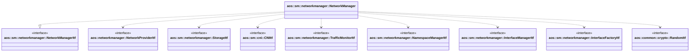

# Network manager

Network manager creates, manages and releases instance networks using CNI plugins. It separates
network lifecycle into logical (CM communication, DB persistence) and physical (bridge/VLAN,
namespace, CNI) operations to support offline SM operation and clean reboot recovery.

## Functionality

The network manager provides the following functionality:

### Instance network operations

- **CreateInstanceNetwork**: Logical network creation (CM + DB). This method:
  - Ensures node network exists (requests parameters from CM via NetworkProviderItf, stores in DB)
  - Allocates instance IP address from CM via NetworkProviderItf
  - Stores network config and allocated parameters in DB and internal cache
  - Returns eAlreadyExist if instance network already created
  - Does NOT create bridge/VLAN, namespace, or CNI

- **StartInstanceNetwork**: Physical network setup (local, no CM calls). This method:
  - Creates bridge/VLAN interfaces if not already created (EnsureNodeNetworkPhysical)
  - Creates a network namespace for the instance
  - Configures CNI plugins (bridge, firewall, bandwidth, DNS)
  - Sets up network interfaces and routing
  - Configures traffic shaping (ingress/egress bandwidth limits)
  - Creates host files and resolv.conf for DNS resolution
  - Starts traffic monitoring for the instance
  - Reads network config and allocated parameters from internal cache

- **StopInstanceNetwork**: Physical network teardown (local, no CM calls). This method:
  - Stops traffic monitoring for the instance
  - Executes CNI plugin DEL command to tear down network configuration
  - Removes network namespace
  - Cleans up network cache
  - Clears bridge/VLAN if last running instance on network
  - Does NOT remove from DB, does NOT call CM

- **ReleaseInstanceNetwork**: Logical network release (DB + CM). This method:
  - Requires StopInstanceNetwork to be called first
  - Removes instance network info from DB and internal cache
  - Releases instance network on CM via NetworkProviderItf
  - Removes node network info from DB and releases on CM if last created instance on network

- **GetNetnsPath**: Returns the filesystem path to the network namespace for a given instance.

### Traffic monitoring

- **GetInstanceTraffic**: Returns the current input and output traffic statistics for a specific
  instance.

- **GetSystemTraffic**: Returns the aggregate input and output traffic statistics for all instances.

- **SetTrafficPeriod**: Configures the traffic monitoring period (minute, hour, day, month, year) for
  traffic accounting.

## Interfaces

It implements the following interfaces:

- [aos::sm::networkmanager::NetworkManagerItf][networkmanager-itf] - implements main network manager
  functionality.

It requires the following interfaces:

- [aos::networkmanager::NetworkProviderItf][networkprovider-itf] - provides network parameters from CM
  (node network params, instance IP allocation/release).
- [aos::sm::networkmanager::StorageItf][storage-itf] - stores and retrieves network configuration data.
- [aos::sm::cni::CNIItf][cni-itf] - provides CNI plugin management functionality.
- [aos::sm::networkmanager::TrafficMonitorItf][trafficmonitor-itf] - monitors network traffic for
  instances.
- [aos::sm::networkmanager::NamespaceManagerItf][namespacemanager-itf] - manages network namespaces.
- [aos::sm::networkmanager::InterfaceManagerItf][interfacemanager-itf] - manages network interfaces.
- [aos::sm::networkmanager::InterfaceFactoryItf][interfacefactory-itf] - creates network interfaces
  (bridges, VLANs).
- [aos::common::crypto::RandomItf][random-itf] - generates random values.

[networkmanager-itf]: itf/networkmanager.hpp
[networkprovider-itf]: ../../common/networkmanager/itf/networkprovider.hpp
[storage-itf]: itf/storage.hpp
[cni-itf]: itf/cni.hpp
[trafficmonitor-itf]: itf/trafficmonitor.hpp
[namespacemanager-itf]: itf/namespacemanager.hpp
[interfacemanager-itf]: itf/interfacemanager.hpp
[interfacefactory-itf]: itf/interfacefactory.hpp
[random-itf]: ../../../common/crypto/itf/rand.hpp

```mermaid
classDiagram
    class NetworkManager ["aos::sm::networkmanager::NetworkManager"] {
    }

    class NetworkManagerItf ["aos::sm::networkmanager::NetworkManagerItf"] {
        <<interface>>
    }

    class NetworkProviderItf ["aos::networkmanager::NetworkProviderItf"] {
        <<interface>>
    }

    class StorageItf ["aos::sm::networkmanager::StorageItf"] {
        <<interface>>
    }

    class CNIItf ["aos::sm::cni::CNIItf"] {
        <<interface>>
    }

    class TrafficMonitorItf ["aos::sm::networkmanager::TrafficMonitorItf"] {
        <<interface>>
    }

    class NamespaceManagerItf ["aos::sm::networkmanager::NamespaceManagerItf"] {
        <<interface>>
    }

    class InterfaceManagerItf ["aos::sm::networkmanager::InterfaceManagerItf"] {
        <<interface>>
    }

    class InterfaceFactoryItf ["aos::sm::networkmanager::InterfaceFactoryItf"] {
        <<interface>>
    }

    class RandomItf ["aos::common::crypto::RandomItf"] {
        <<interface>>
    }

    NetworkManager ..|> NetworkManagerItf

    NetworkManager ..> NetworkProviderItf
    NetworkManager ..> StorageItf
    NetworkManager ..> CNIItf
    NetworkManager ..> TrafficMonitorItf
    NetworkManager ..> NamespaceManagerItf
    NetworkManager ..> InterfaceManagerItf
    NetworkManager ..> InterfaceFactoryItf
    NetworkManager ..> RandomItf
```
