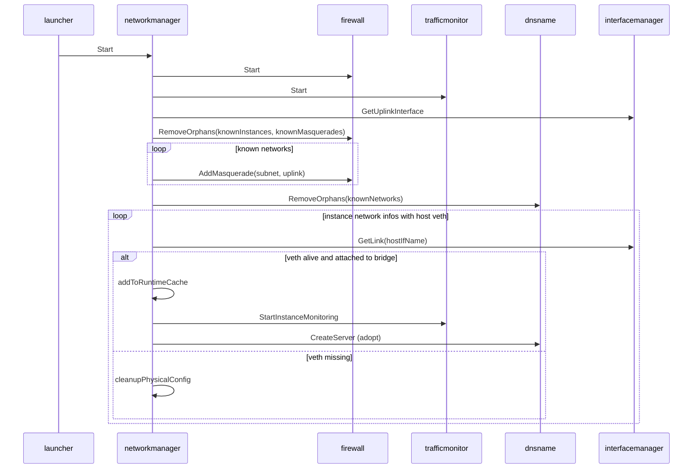
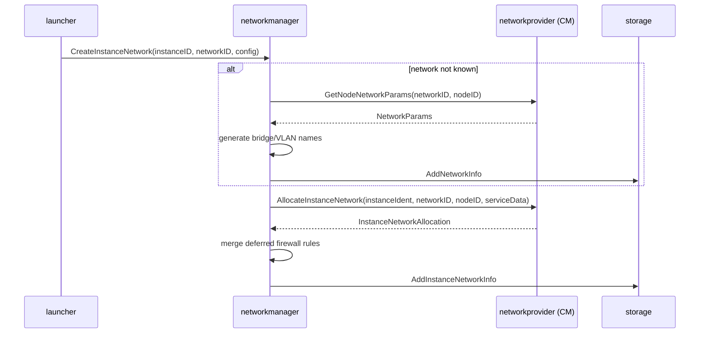
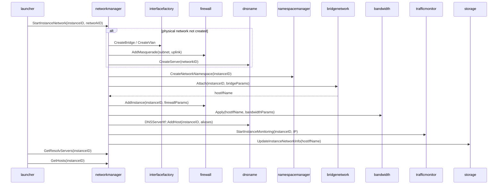
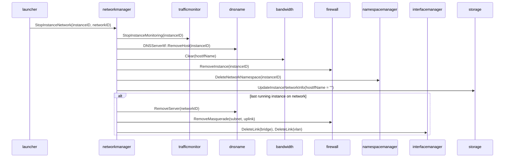
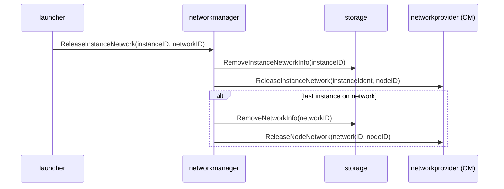

# Network manager

Network manager creates, manages and releases instance networks on the node. Every instance gets its own network
namespace, a veth pair attached to a per-network bridge, a per-instance firewall chain, optional bandwidth shaping,
DNS registration on the per-bridge resolver and traffic accounting. All of this is implemented natively on top of Linux
networking primitives; no external CNI plugin binaries are used.

The overall networking architecture (components, Linux foundations, host firewall tables) is described in the public
documentation:

- [Networking overview][arch-overview];
- [Per-instance network lifecycle][arch-lifecycle].

The contract between SM and CM (network parameters allocation, release, state synchronization and deferred firewall
updates) is described in [common network manager][common-networkmanager]. This document only covers the SM
implementation of that contract.

[arch-overview]: https://github.com/aosedge/public-docs/blob/main/docs/aos-core/14-network/index.md
[arch-lifecycle]: https://github.com/aosedge/public-docs/blob/main/docs/aos-core/14-network/per-instance-networking.md
[common-networkmanager]: ../../common/networkmanager/networkmanager.md

## Design

Network lifecycle is split into logical and physical parts:

- **logical** (CM communication and DB persistence): `CreateInstanceNetwork`, `ReleaseInstanceNetwork`;
- **physical** (bridge/VLAN, namespace, veth, firewall, bandwidth, DNS, traffic accounting):
  `StartInstanceNetwork`, `StopInstanceNetwork`.

The logical state is persisted in the storage, so the physical network can be rebuilt after SM restart without
contacting CM. This allows SM to run offline and recover cleanly after a reboot.

Network manager keeps the following state:

- **network infos** (`NetworkInfo`) - node network parameters received from CM (subnet, bridge IP, VLAN ID) plus
  generated bridge and VLAN interface names. Persisted in the storage;
- **instance network infos** (`InstanceNetworkInfo`) - instance network config (`InstanceNetworkConfig`), parameters
  allocated by CM (`InstanceNetworkAllocation`) and the host-side veth name once the instance is started. Persisted in
  the storage;
- **runtime cache** - instances that are currently physically started, grouped by network. Not persisted;
- **physical networks** - networks whose bridge/VLAN/masquerade/DNS server are currently created. Not persisted;
- **deferred firewall updates** - pending firewall updates received from CM for instances that are not created yet.
  Not persisted.

It implements the following interfaces:

- [aos::sm::networkmanager::NetworkManagerItf](itf/networkmanager.hpp) - implements main network manager
  functionality. It inherits the following interfaces:
  - [aos::sm::networkmanager::SystemTrafficProviderItf](itf/systemtrafficprovider.hpp) - provides system traffic;
  - [aos::sm::networkmanager::InstanceTrafficProviderItf](itf/instancetrafficprovider.hpp) - provides instance
    traffic;
  - [aos::networkmanager::PendingUpdateHandlerItf](../../common/networkmanager/itf/pendingupdatehandler.hpp) -
    receives resolved pending firewall rules from CM;
  - [aos::sm::smclient::ConnectListenerItf](../smclient/itf/connection.hpp) - receives CM connection events to
    synchronize network state.

It requires the following interfaces:

- [aos::networkmanager::NetworkProviderItf](../../common/networkmanager/itf/networkprovider.hpp) - requests node and
  instance network parameters from CM, releases them and synchronizes network state (see
  [common network manager][common-networkmanager]);
- [aos::sm::networkmanager::StorageItf](itf/storage.hpp) - persistently stores network infos, instance network infos
  and traffic monitor data; provides transactions for batch operations;
- [aos::sm::networkmanager::BridgeNetworkItf](itf/bridgenetwork.hpp) - attaches/detaches an instance to the bridge
  (veth pair, IP, route, hairpin);
- [aos::sm::networkmanager::FirewallItf](itf/firewall.hpp) - manages per-instance firewall chains and per-network
  masquerade rules in a single nft table;
- [aos::sm::networkmanager::BandwidthItf](itf/bandwidth.hpp) - applies/clears tc shaping on the host-side veth;
- [aos::sm::networkmanager::DNSNameItf](itf/dnsname.hpp) - creates per-network DNS servers
  ([aos::sm::networkmanager::DNSServerItf](itf/dnsname.hpp)) that register instance hosts and aliases;
- [aos::sm::networkmanager::TrafficMonitorItf](itf/trafficmonitor.hpp) - accounts instance and system traffic;
- [aos::sm::networkmanager::NamespaceManagerItf](itf/namespacemanager.hpp) - manages network namespaces;
- [aos::sm::networkmanager::InterfaceManagerItf](itf/interfacemanager.hpp) - inspects and manages network links,
  provides uplink interface name;
- [aos::sm::networkmanager::InterfaceFactoryItf](itf/interfacefactory.hpp) - creates bridges and VLAN interfaces;
- [aos::common::crypto::RandomItf](../../common/crypto/itf/rand.hpp) - generates random bridge/VLAN interface names.

```mermaid
classDiagram
    direction TB

    class SystemTrafficProviderItf ["aos::sm::networkmanager::SystemTrafficProviderItf"] {
        <<interface>>
    }
    class InstanceTrafficProviderItf ["aos::sm::networkmanager::InstanceTrafficProviderItf"] {
        <<interface>>
    }
    class PendingUpdateHandlerItf ["aos::networkmanager::PendingUpdateHandlerItf"] {
        <<interface>>
    }
    class ConnectListenerItf ["aos::sm::smclient::ConnectListenerItf"] {
        <<interface>>
    }

    class NetworkManagerItf ["aos::sm::networkmanager::NetworkManagerItf"] {
        <<interface>>
    }

    class NetworkManager ["aos::sm::networkmanager::NetworkManager"] {
    }

    class NetworkProviderItf ["aos::networkmanager::NetworkProviderItf"] {
        <<interface>>
    }
    class StorageItf ["aos::sm::networkmanager::StorageItf"] {
        <<interface>>
    }
    class BridgeNetworkItf ["aos::sm::networkmanager::BridgeNetworkItf"] {
        <<interface>>
    }
    class FirewallItf ["aos::sm::networkmanager::FirewallItf"] {
        <<interface>>
    }
    class BandwidthItf ["aos::sm::networkmanager::BandwidthItf"] {
        <<interface>>
    }
    class DNSNameItf ["aos::sm::networkmanager::DNSNameItf"] {
        <<interface>>
    }
    class DNSServerItf ["aos::sm::networkmanager::DNSServerItf"] {
        <<interface>>
    }
    class TrafficMonitorItf ["aos::sm::networkmanager::TrafficMonitorItf"] {
        <<interface>>
    }
    class NamespaceManagerItf ["aos::sm::networkmanager::NamespaceManagerItf"] {
        <<interface>>
    }
    class InterfaceManagerItf ["aos::sm::networkmanager::InterfaceManagerItf"] {
        <<interface>>
    }
    class InterfaceFactoryItf ["aos::sm::networkmanager::InterfaceFactoryItf"] {
        <<interface>>
    }
    class RandomItf ["aos::common::crypto::RandomItf"] {
        <<interface>>
    }

    %% base interfaces of NetworkManagerItf
    SystemTrafficProviderItf <|-- NetworkManagerItf
    InstanceTrafficProviderItf <|-- NetworkManagerItf
    PendingUpdateHandlerItf <|-- NetworkManagerItf
    ConnectListenerItf <|-- NetworkManagerItf

    %% implementation
    NetworkManagerItf <|.. NetworkManager

    %% required interfaces
    NetworkManager ..> NetworkProviderItf
    NetworkManager ..> StorageItf
    NetworkManager ..> BridgeNetworkItf
    NetworkManager ..> FirewallItf
    NetworkManager ..> BandwidthItf
    NetworkManager ..> DNSNameItf
    NetworkManager ..> DNSServerItf
    NetworkManager ..> TrafficMonitorItf
    NetworkManager ..> NamespaceManagerItf
    NetworkManager ..> InterfaceManagerItf
    NetworkManager ..> InterfaceFactoryItf
    NetworkManager ..> RandomItf
```

## Initialization

`Init` stores the dependencies and loads network infos and instance network infos from the storage into the internal
cache. No CM calls and no physical changes are made at this stage.

`Start` brings the node into a consistent state after SM (re)start:

1. starts the firewall (creates the nft table, base chains and hooks if absent) and the traffic monitor;
2. resolves the uplink interface (the one the default route points to) used for masquerade;
3. removes orphan firewall chains and masquerade rules that do not belong to any known instance/network;
4. re-asserts masquerade rules for all known networks;
5. removes orphan DNS servers left from the previous SM lifetime;
6. reconciles instances: for every instance network info that has a host-side veth name recorded, checks whether the
   veth still exists and is attached to the expected bridge. If it is alive, the instance is adopted: it is added to the
   runtime cache, traffic monitoring is restarted and the DNS server for its network is adopted. Otherwise the leftover
   physical configuration (DNS host, bandwidth, firewall chain, namespace) is cleaned up.

Adopted instances are treated as running, so the launcher does not need to restart them.

```mermaid
sequenceDiagram
    participant launcher
    participant networkmanager
    participant firewall
    participant trafficmonitor
    participant dnsname
    participant interfacemanager

    launcher ->> networkmanager: Start

    networkmanager ->> firewall: Start
    networkmanager ->> trafficmonitor: Start
    networkmanager ->> interfacemanager: GetUplinkInterface
    networkmanager ->> firewall: RemoveOrphans(knownInstances, knownMasquerades)

    loop known networks
        networkmanager ->> firewall: AddMasquerade(subnet, uplink)
    end

    networkmanager ->> dnsname: RemoveOrphans(knownNetworks)

    loop instance network infos with host veth
        networkmanager ->> interfacemanager: GetLink(hostIfName)

        alt veth alive and attached to bridge
            networkmanager ->> networkmanager: addToRuntimeCache
            networkmanager ->> trafficmonitor: StartInstanceMonitoring
            networkmanager ->> dnsname: CreateServer (adopt)
        else veth missing
            networkmanager ->> networkmanager: cleanupPhysicalConfig
        end
    end
```

`Stop` stops the traffic monitor and the firewall (deletes the nft table). Instance networks are not touched.

## Instance network lifecycle

The typical sequence for an instance is `CreateInstanceNetwork` -> `StartInstanceNetwork` -> `GetResolvServers` /
`GetHosts` -> ... -> `StopInstanceNetwork` -> `ReleaseInstanceNetwork`.

### Create instance network

`CreateInstanceNetwork` performs the logical part only (CM + DB):

1. returns `eAlreadyExist` if the instance network is already created;
2. ensures node network exists: if the network is not known yet, requests node network parameters from CM
   (`GetNodeNetworkParams`), generates unique bridge (`br-*`) and VLAN (`vlan-*`) interface names and stores the
   network info in the storage;
3. allocates instance network on CM (`AllocateInstanceNetwork`) passing hostname, aliases, exposed ports and allowed
   connections. CM returns IP, subnet, DNS servers and firewall rules;
4. merges any deferred firewall rules previously received for this instance (see
   [Deferred firewall updates](#deferred-firewall-updates));
5. stores instance network info in the storage and in the internal cache.

On any failure the allocation is released on CM and the cache is rolled back. No bridge/VLAN, namespace or veth is
created here.

```mermaid
sequenceDiagram
    participant launcher
    participant networkmanager
    participant networkprovider as networkprovider (CM)
    participant storage

    launcher ->> networkmanager: CreateInstanceNetwork(instanceID, networkID, config)

    alt network not known
        networkmanager ->> networkprovider: GetNodeNetworkParams(networkID, nodeID)
        networkprovider -->> networkmanager: NetworkParams
        networkmanager ->> networkmanager: generate bridge/VLAN names
        networkmanager ->> storage: AddNetworkInfo
    end

    networkmanager ->> networkprovider: AllocateInstanceNetwork(instanceIdent, networkID, nodeID, serviceData)
    networkprovider -->> networkmanager: InstanceNetworkAllocation
    networkmanager ->> networkmanager: merge deferred firewall rules
    networkmanager ->> storage: AddInstanceNetworkInfo
```

### Start instance network

`StartInstanceNetwork` performs the physical part only, using the cached parameters. It does not call CM. It returns
`eNotFound` if `CreateInstanceNetwork` was not called for the instance and `eInvalidArgument` if the network ID does not
match the created one.

1. adds the instance to the runtime cache and checks that its hostname and aliases are unique within the network;
2. ensures the physical node network exists: if the bridge and VLAN links are not created yet, creates them (an
   existing link left from a crashed SM is adopted, not recreated), installs the masquerade rule for the network
   subnet on the uplink interface and creates the per-network DNS server;
3. creates the instance network namespace;
4. attaches the instance to the bridge: creates a veth pair, moves the peer end into the namespace, assigns IP and
   default route via the bridge IP, enables hairpin;
5. adds the per-instance firewall chain: exposed ports as input rules, CM firewall rules as output rules;
6. applies bandwidth shaping to the host-side veth if ingress or egress limit is set;
7. registers the instance IP with its hostname, aliases and instance identifier names on the network DNS server;
8. starts traffic monitoring for the instance IP with upload/download limits;
9. stores the host-side veth name in the instance network info (used for reconciliation after restart).

On any failure the completed steps are unwound in reverse order.

The hosts file and resolv.conf are not written by network manager. The caller obtains their content via `GetHosts`
and `GetResolvServers` after `StartInstanceNetwork` and writes the files itself.

```mermaid
sequenceDiagram
    participant launcher
    participant networkmanager
    participant interfacefactory
    participant firewall
    participant dnsname
    participant namespacemanager
    participant bridgenetwork
    participant bandwidth
    participant trafficmonitor
    participant storage

    launcher ->> networkmanager: StartInstanceNetwork(instanceID, networkID)

    alt physical network not created
        networkmanager ->> interfacefactory: CreateBridge / CreateVlan
        networkmanager ->> firewall: AddMasquerade(subnet, uplink)
        networkmanager ->> dnsname: CreateServer(networkID)
    end

    networkmanager ->> namespacemanager: CreateNetworkNamespace(instanceID)
    networkmanager ->> bridgenetwork: Attach(instanceID, bridgeParams)
    bridgenetwork -->> networkmanager: hostIfName
    networkmanager ->> firewall: AddInstance(instanceID, firewallParams)
    networkmanager ->> bandwidth: Apply(hostIfName, bandwidthParams)
    networkmanager ->> dnsname: DNSServerItf::AddHost(instanceID, aliases)
    networkmanager ->> trafficmonitor: StartInstanceMonitoring(instanceID, IP)
    networkmanager ->> storage: UpdateInstanceNetworkInfo(hostIfName)

    launcher ->> networkmanager: GetResolvServers(instanceID)
    launcher ->> networkmanager: GetHosts(instanceID)
```

### Stop instance network

`StopInstanceNetwork` tears down the physical part only. It does not remove anything from the storage and does not call
CM. If the instance is not running (not in the runtime cache), it returns `eNone`.

1. stops traffic monitoring;
2. removes the instance host from the network DNS server;
3. clears bandwidth shaping if it was applied;
4. removes the per-instance firewall chain;
5. deletes the network namespace. The veth pair is not detached explicitly: the kernel removes both ends together with
   the namespace;
6. clears the host-side veth name in the instance network info;
7. removes the instance from the runtime cache;
8. if it was the last running instance on the network, clears the physical network: removes the DNS server, the
   masquerade rule and the bridge/VLAN links.

```mermaid
sequenceDiagram
    participant launcher
    participant networkmanager
    participant trafficmonitor
    participant dnsname
    participant bandwidth
    participant firewall
    participant namespacemanager
    participant interfacemanager
    participant storage

    launcher ->> networkmanager: StopInstanceNetwork(instanceID, networkID)

    networkmanager ->> trafficmonitor: StopInstanceMonitoring(instanceID)
    networkmanager ->> dnsname: DNSServerItf::RemoveHost(instanceID)
    networkmanager ->> bandwidth: Clear(hostIfName)
    networkmanager ->> firewall: RemoveInstance(instanceID)
    networkmanager ->> namespacemanager: DeleteNetworkNamespace(instanceID)
    networkmanager ->> storage: UpdateInstanceNetworkInfo(hostIfName = "")

    alt last running instance on network
        networkmanager ->> dnsname: RemoveServer(networkID)
        networkmanager ->> firewall: RemoveMasquerade(subnet, uplink)
        networkmanager ->> interfacemanager: DeleteLink(bridge), DeleteLink(vlan)
    end
```

### Release instance network

`ReleaseInstanceNetwork` performs the logical release (DB + CM). It requires `StopInstanceNetwork` to be called first
and returns `eInvalidArgument` if the instance is still running.

1. removes instance network info from the internal cache and the storage;
2. releases instance network on CM (`ReleaseInstanceNetwork`);
3. if it was the last created instance on the network, removes network info from the storage and releases node
   network on CM (`ReleaseNodeNetwork`).

Storage and CM failures are logged as warnings and do not fail the release.

```mermaid
sequenceDiagram
    participant launcher
    participant networkmanager
    participant storage
    participant networkprovider as networkprovider (CM)

    launcher ->> networkmanager: ReleaseInstanceNetwork(instanceID, networkID)

    networkmanager ->> storage: RemoveInstanceNetworkInfo(instanceID)
    networkmanager ->> networkprovider: ReleaseInstanceNetwork(instanceIdent, nodeID)

    alt last instance on network
        networkmanager ->> storage: RemoveNetworkInfo(networkID)
        networkmanager ->> networkprovider: ReleaseNodeNetwork(networkID, nodeID)
    end
```

## Batch operations

When many instances are started or stopped at once (e.g. on update instances), the caller can wrap the
`StartInstanceNetwork` / `StopInstanceNetwork` calls into a batch:

- `BeginBatch` opens a storage transaction and puts the firewall and the traffic monitor into batch mode. Firewall chain
  and traffic counter changes are staged instead of being applied immediately;
- `FlushBatch` commits the batch: flushes the firewall batch, then the traffic monitor batch, then the storage
  transaction. If any step fails, the already applied steps are reverted and the staged operations are re-applied one
  by one outside the batch. Instances that could not be re-applied are returned in `failedInstanceIDs`.

Namespace, veth, bandwidth and DNS changes are applied immediately even in batch mode.

## Deferred firewall updates

When an instance has allowed connections to an instance that is not yet allocated, CM returns partial firewall rules on
`AllocateInstanceNetwork` and pushes the missing ones later via `OnPendingFirewallUpdate` (see
[common network manager][common-networkmanager]).

On `OnPendingFirewallUpdate` network manager:

1. ignores the update if the node ID does not match its own;
2. if the instance is not created yet, buffers the rules in the deferred firewall updates. They are merged into the
   allocated parameters on the next `CreateInstanceNetwork` for that instance;
3. otherwise merges the received rules into the instance allocated parameters (duplicates are skipped) and updates the
   instance network info in the storage;
4. if the instance is running, atomically replaces its firewall chain with the merged rules
   (`FirewallItf::UpdateInstance`). Other parts of the instance network are not touched.

## Network state synchronization

Network manager implements `ConnectListenerItf`. On `OnConnect` (SM connected or reconnected to CM) it sends the state
of all running instances (instance identifier, network ID, IP and firewall rules) to CM via
`NetworkProviderItf::SyncNetworkState`, so CM can reconcile its allocation view with what is actually running on the
node.

## Traffic monitoring

- `GetInstanceTraffic` - returns input and output traffic of the instance;
- `GetSystemTraffic` - returns aggregate input and output traffic of all instances;
- `SetTrafficPeriod` - sets the traffic accounting period (minute, hour, day, month, year).

## aos::sm::networkmanager::NetworkManagerItf

### CreateInstanceNetwork

Creates instance network: requests node network from CM if needed, allocates instance IP on CM, stores network config
and allocated parameters in the storage. Returns `eAlreadyExist` if already created.

### StartInstanceNetwork

Starts instance network: creates bridge/VLAN if needed, namespace, veth, firewall chain, bandwidth shaping, DNS
registration and traffic monitoring. Does not call CM.

### GetResolvServers

Returns resolver IPs for the instance: the bridge IP (per-bridge DNS server) first, then the DNS servers allocated by
CM. If the list is empty, a public DNS server is returned. The caller writes resolv.conf itself and prefixes each entry
with `nameserver`. Call after `StartInstanceNetwork`.

### GetHosts

Returns hosts entries for the instance: localhost entries, the instance IP with the network ID and hostname, and the
custom hosts from the instance network config. The caller writes the hosts file itself. Call after
`StartInstanceNetwork`.

### StopInstanceNetwork

Stops instance network: tears down traffic monitoring, DNS, bandwidth, firewall and namespace. Clears bridge/VLAN if
it was the last running instance on the network. Does not touch the storage and does not call CM.

### ReleaseInstanceNetwork

Releases instance network: removes it from the storage and releases it on CM. Releases node network on CM if it was
the last instance on the network. Requires `StopInstanceNetwork` to be called first.

### BeginBatch / FlushBatch

Stage start/stop operations and apply them atomically across firewall, traffic monitor and storage.

### GetNetnsPath

Returns the network namespace path of the instance.

### SetTrafficPeriod

Sets the traffic accounting period.

## aos::networkmanager::PendingUpdateHandlerItf

### OnPendingFirewallUpdate

Applies resolved pending firewall rules to the instance, or defers them if the instance is not created yet.

## aos::sm::smclient::ConnectListenerItf

### OnConnect

Sends running instances network state to CM for reconciliation.
