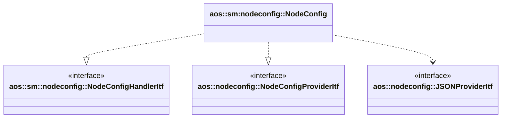

# Node config

Implements node config update and provides node config for other modules.

It implements the following interfaces:

* [aos::sm::nodeconfig::NodeConfigHandlerItf](itf/nodeconfighandler.hpp) - updates node config;
* [aos::nodeconfig::NodeConfigProviderItf](../../common/nodeconfig/itf/nodeconfigprovider.hpp) - provides node config
  for other modules.

It uses the following interfaces:

* [aos::nodeconfig::JSONProviderItf](../../common/nodeconfig/itf/jsonprovider.hpp) - converts node config to/from JSON.

