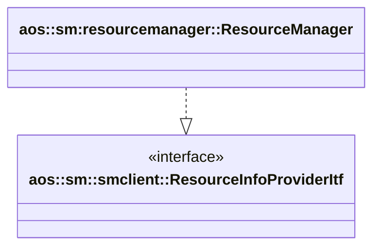

# Resource manager

Provides resource info for other modules.

It implements the following interfaces:

* [aos::sm::smclient::ResourceInfoProviderItf](../smclient/itf/resourceinfoprovider.hpp) - provides resources info.

