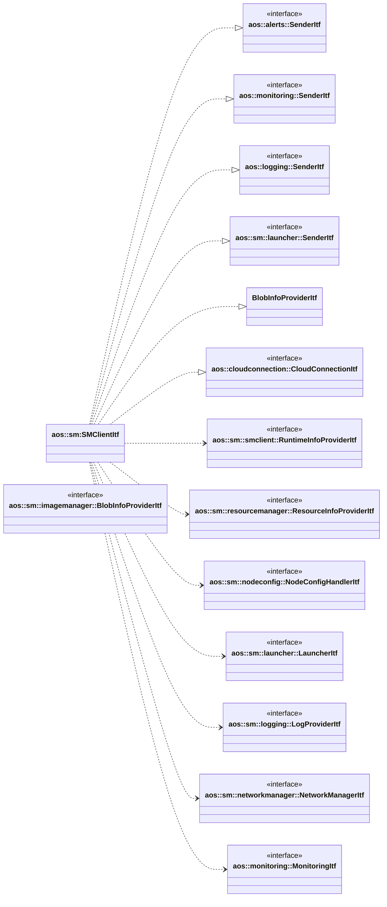

# SM client

Manages communication with CM.

It implements the following interfaces:

* [aos::alerts::SenderItf](../../common/alerts/itf/sender.hpp) - sends alerts to CM;
* [aos::monitoring::SenderItf](../../common/monitoring/itf/sender.hpp) - sends monitoring to CM;
* [aos::logging::SenderItf](../../common/logging/itf/sender.hpp) - sends system and instances logs to CM;
* [aos::sm::launcher::SenderItf](../launcher/itf/sender.hpp) - sends update items statuses to CM;
* [aos::sm::imagemanager::BlobInfoProviderItf](../imagemanager/itf/blobinfoprovider.hpp) - provides blobs info;
* [aos::cloudconnection::CloudConnectionItf](../../common/cloudconnection/itf/cloudconnection.hpp) - provides cloud
  connection status.

It uses the following interfaces:

* [aos::sm::smclient::RuntimeInfoProviderItf](itf/runtimeinfoprovider.hpp) - provides runtimes info;
* [aos::sm::resourcemanager::ResourceInfoProviderItf](../resourcemanager/itf/resourceinfoprovider.hpp) - provides
resources info;
* [aos::sm::nodeconfig::NodeConfigHandlerItf](../nodeconfig/itf/nodeconfighandler.hpp) - updates node config;
* [aos::sm::launcher::LauncherItf](../launcher/itf/launcher.hpp) - starts/stops update item instances;
* [aos::sm::logging::LogProviderItf](../logging/itf/logprovider.hpp) - provides systemd and instances logs;
* [aos::sm::networkmanager::NetworkManagerItf](../networkmanager/itf/networkmanager.hpp) - setups network;
* [aos::monitoring::MonitoringItf](../../common/monitoring/itf/monitoring.hpp) - provides average monitoring data.

